# System Design — Comprehensive Interview Preparation Guide

> **How to use this guide:** Follow the **interview framework** for every problem: requirements → estimates → design → deep dive → trade-offs. Drill classic designs and the **Cheat Sheet** before interviews.

---

## Table of Contents

1. [What Is System Design](#1-what-is-system-design)
2. [Scalability](#2-scalability)
3. [Availability & Reliability](#3-availability--reliability)
4. [Consistency & CAP Theorem](#4-consistency--cap-theorem)
5. [Load Balancer & Reverse Proxy](#5-load-balancer--reverse-proxy)
6. [CDN & Caching](#6-cdn--caching)
7. [Redis](#7-redis)
8. [Database Scaling](#8-database-scaling)
9. [Replication, Sharding & Partitioning](#9-replication-sharding--partitioning)
10. [Message Queues](#10-message-queues)
11. [Monolith vs Microservices](#11-monolith-vs-microservices)
12. [API Gateway & Service Discovery](#12-api-gateway--service-discovery)
13. [Event-Driven Architecture](#13-event-driven-architecture)
14. [CQRS & Saga Pattern](#14-cqrs--saga-pattern)
15. [Distributed Transactions](#15-distributed-transactions)
16. [Real-Time Communication](#16-real-time-communication)
17. [Rate Limiting](#17-rate-limiting)
18. [Monitoring, Logging & Distributed Tracing](#18-monitoring-logging--distributed-tracing)
19. [Design: URL Shortener](#19-design-url-shortener)
20. [Design: Chat App](#20-design-chat-app)
21. [Design: Notification System](#21-design-notification-system)
22. [Design: Ride Sharing](#22-design-ride-sharing)
23. [Design: Food Delivery](#23-design-food-delivery)
24. [Design: Video Streaming](#24-design-video-streaming)
25. [Scenario Questions](#25-scenario-questions)
26. [Cheat Sheet](#26-cheat-sheet)

---

## 1. What Is System Design

### Q: What is system design?

**A:** The process of defining architecture, components, modules, interfaces, and data flows for a software system to meet **functional** and **non-functional** requirements (scale, latency, availability, cost).

### Q: What do interviewers evaluate?

**A:**
- Requirement clarification (functional + non-functional)
- High-level architecture
- Data modeling
- Scalability and bottlenecks
- Trade-off reasoning (CAP, SQL vs NoSQL)
- Failure handling and monitoring
- Estimation (traffic, storage, bandwidth)

### Q: Interview framework (45 min)?

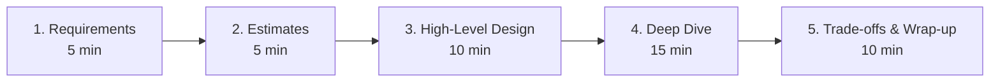

| Step | Actions |
|------|---------|
| **Requirements** | Features, users, scale, latency, consistency |
| **Estimates** | QPS, storage, bandwidth (back-of-envelope) |
| **High-level** | Clients, LB, services, DB, cache, queue |
| **Deep dive** | Hot path, data model, scaling strategy |
| **Trade-offs** | What you'd improve with more time/money |

### Q: Back-of-envelope math shortcuts?

| Unit | Value |
|------|-------|
| 1 day | ~100K seconds (use 10⁵) |
| 1 million | 10⁶ |
| 1 billion | 10⁹ |
| Read:write ratio | Often 10:1 or 100:1 |

### Q: Functional vs non-functional requirements?

| Functional | Non-Functional |
|------------|----------------|
| What the system does | How well it does it |
| Features, APIs | Latency, availability, scale, security |
| "Users can send messages" | "p99 < 200ms, 99.9% uptime" |

---

## 2. Scalability

### Q: What is scalability?

**A:** Ability of a system to handle increased load by adding resources — without redesign.

### Q: Vertical vs horizontal scaling?

| | Vertical (Scale Up) | Horizontal (Scale Out) |
|--|---------------------|------------------------|
| **How** | Bigger CPU/RAM/disk | More machines |
| **Pros** | Simple, no distributed complexity | Theoretically unlimited |
| **Cons** | Hardware ceiling, downtime to upgrade | Needs load balancing, stateless design |
| **Use** | Early stage, DB primary | Web servers, read replicas |

### Q: What makes a service horizontally scalable?

**A:** **Stateless** application servers (session in Redis/JWT), shared nothing architecture, externalized state (DB, cache, object storage).

### Q: Stateless vs stateful?

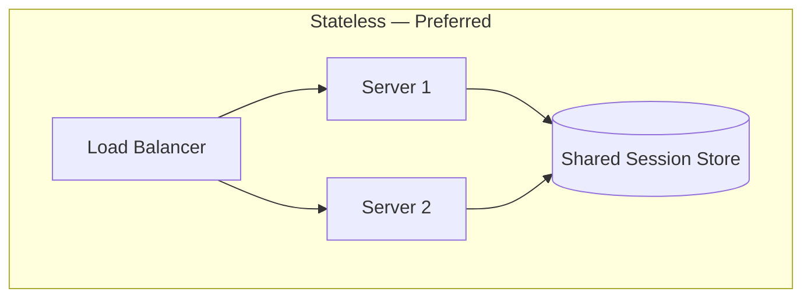

**Stateful:** Sticky sessions required (WebSocket rooms, gaming) — harder to scale; use consistent hashing.

### Q: What is elasticity?

**A:** Auto-scale resources up/down based on demand (AWS Auto Scaling, Kubernetes HPA). Pay for what you use; handle traffic spikes.

---

## 3. Availability & Reliability

### Q: Availability vs reliability?

| Term | Meaning |
|------|---------|
| **Availability** | System is operational (uptime %) |
| **Reliability** | System performs correctly over time |
| **Durability** | Data is not lost once written |

### Q: Common availability numbers?

| SLA | Downtime/year |
|-----|---------------|
| 99% (2 nines) | 3.65 days |
| 99.9% (3 nines) | 8.76 hours |
| 99.99% (4 nines) | 52.6 minutes |
| 99.999% (5 nines) | 5.26 minutes |

### Q: How to achieve high availability?

**A:** Redundancy, load balancing, health checks, auto-failover, multi-AZ deployment, circuit breakers, graceful degradation, no single point of failure (SPOF).

### Q: What is a single point of failure (SPOF)?

**A:** Component whose failure stops entire system. **Fix:** replicate (multiple LBs with VIP, DB replicas, multi-region).

### Q: Active-active vs active-passive?

| Active-Passive | Active-Active |
|----------------|---------------|
| Standby takes over on failure | All nodes serve traffic |
| Simpler failover | Higher complexity, conflict resolution |
| DR site | Multi-region load balancing |

### Q: What is graceful degradation?

**A:** System continues with reduced functionality when components fail — e.g., disable recommendations but keep checkout working.

---

## 4. Consistency & CAP Theorem

### Q: What is CAP theorem?

**A:** In a **partitioned** distributed system, you can guarantee at most **two** of:
- **C** — Consistency (all nodes see same data)
- **A** — Availability (every request gets a response)
- **P** — Partition tolerance (system works despite network splits)

**Reality:** Partitions happen → choose **CP** or **AP**.

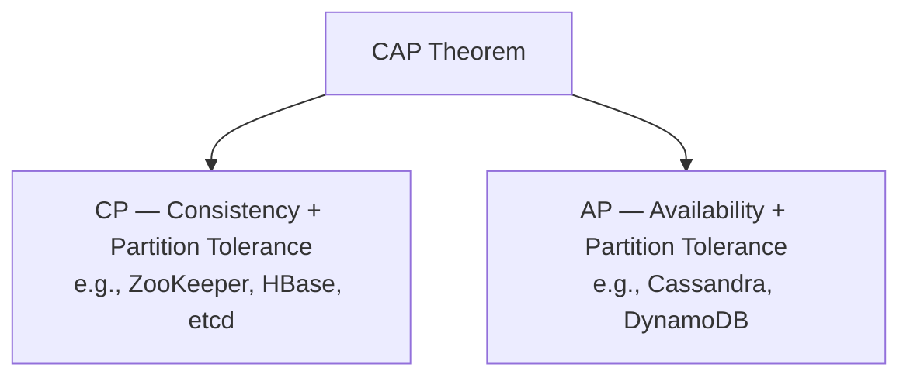

### Q: Strong vs eventual consistency?

| Strong | Eventual |
|--------|----------|
| Read returns latest write | Replicas converge over time |
| Higher latency | Lower latency, higher availability |
| Banking balances | Social media likes, feeds |

### Q: ACID vs BASE?

| ACID (SQL) | BASE (NoSQL) |
|------------|--------------|
| Atomicity, Consistency, Isolation, Durability | Basically Available, Soft state, Eventual consistency |
| Strong guarantees | Scale-first, relaxed consistency |

### Q: What is PACELC?

**A:** Extension of CAP: if **P**artition, choose **A** or **C**; **E**lse (normal operation), choose **L**atency or **C**onsistency. Example: DynamoDB favors latency over consistency when no partition.

---

## 5. Load Balancer & Reverse Proxy

### Q: What is a load balancer?

**A:** Distributes incoming traffic across multiple servers to improve availability, throughput, and fault tolerance.

### Q: Load balancing algorithms?

| Algorithm | Use Case |
|-----------|----------|
| **Round Robin** | Equal capacity servers |
| **Least Connections** | Long-lived connections |
| **Weighted** | Heterogeneous server sizes |
| **IP Hash / Consistent Hash** | Session affinity, caching |
| **Least Response Time** | Latency-sensitive |

### Q: Layer 4 vs Layer 7 LB?

| L4 (Transport) | L7 (Application) |
|----------------|------------------|
| TCP/UDP, IP + port | HTTP headers, path, cookies |
| Faster, less context | Content-based routing, SSL termination |

### Q: Reverse proxy vs forward proxy?

| Forward Proxy | Reverse Proxy |
|---------------|---------------|
| Client knows about it | Client doesn't know backend |
| Hides clients | Hides servers |
| Corporate firewall | Nginx in front of app servers |

**Reverse proxy uses:** SSL termination, caching, compression, security (WAF), routing to microservices.

### Q: Health checks?

**A:** LB pings `/health` endpoint. Unhealthy servers removed from pool. Types: HTTP, TCP, custom. Prevents routing to crashed instances.

---

## 6. CDN & Caching

### Q: What is a CDN?

**A:** Geographically distributed edge servers that cache static content close to users — reduces latency and origin load.

**Cache:** JS, CSS, images, video segments, static HTML.  
**Don't cache (usually):** Personalized API, auth responses.

### Q: Caching strategies?

| Strategy | Description |
|----------|-------------|
| **Cache-aside** | App checks cache; on miss, read DB, write cache |
| **Read-through** | Cache loads from DB on miss |
| **Write-through** | Write to cache + DB synchronously |
| **Write-behind** | Write to cache; async flush to DB |
| **Refresh-ahead** | Proactively refresh before expiry |

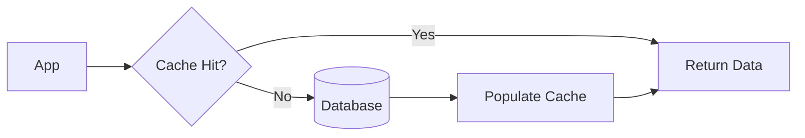

### Q: Cache invalidation?

**A:** Hardest problem in computer science. Strategies: TTL, event-driven purge, versioned keys, write-through on updates.

### Q: Cache stampede / thundering herd?

**A:** Many requests miss cache simultaneously and hit DB. **Fix:** request coalescing (single flight), probabilistic early expiration, mutex lock on cache miss, pre-warm cache.

---

## 7. Redis

### Q: What is Redis?

**A:** In-memory data structure store — used as cache, session store, pub/sub, rate limiter, leaderboard, distributed lock.

### Q: Common Redis use cases in system design?

| Use Case | Structure |
|----------|-----------|
| Session store | String / Hash |
| Cache | String with TTL |
| Leaderboard | Sorted Set |
| Rate limiting | String + INCR + EXPIRE |
| Pub/Sub | Channels |
| Distributed lock | SET NX EX |
| Geospatial | GEOADD / GEORADIUS |
| Feed timeline | Sorted Set |
| Bloom filter | RedisBloom module |

### Q: Redis persistence?

**A:** RDB (snapshots) + AOF (append-only log). For pure cache, persistence optional. For session store, enable AOF.

### Q: Redis vs Memcached?

| Redis | Memcached |
|-------|-----------|
| Rich data structures | Simple key-value |
| Persistence optional | Pure cache |
| Pub/sub, Lua scripts | Multi-threaded, simpler |

### Q: Redis cluster?

**A:** Sharded across nodes with hash slots (16384). Automatic failover with replicas. Used when single Redis instance exceeds memory.

---

## 8. Database Scaling

### Q: SQL vs NoSQL — when to use?

| SQL | NoSQL |
|-----|-------|
| Structured data, joins, ACID | Flexible schema, horizontal scale |
| Complex queries | High write throughput, documents |
| PostgreSQL, MySQL | MongoDB, Cassandra, DynamoDB |

**Polyglot persistence:** Use both — Postgres for transactions, Elasticsearch for search, Redis for cache.

### Q: Database scaling techniques?

1. **Indexing** — faster reads
2. **Read replicas** — offload reads
3. **Caching** — Redis for hot data
4. **Sharding** — partition data horizontally
5. **Denormalization** — reduce joins
6. **Archiving** — move cold data
7. **Connection pooling** — reuse connections

### Q: When to choose Cassandra vs MongoDB vs Postgres?

| DB | Best For |
|----|----------|
| **Postgres** | ACID, joins, complex queries |
| **MongoDB** | Flexible documents, moderate scale |
| **Cassandra** | Massive writes, time-series, no joins |
| **DynamoDB** | Managed, key-value, AWS-native scale |

---

## 9. Replication, Sharding & Partitioning

### Q: What is replication?

**A:** Copying data across multiple DB nodes.

| Type | Description |
|------|-------------|
| **Leader-Follower** | Writes to leader; reads from replicas |
| **Multi-leader** | Writes to multiple nodes (conflict resolution) |
| **Leaderless** | Quorum reads/writes (Dynamo-style) |

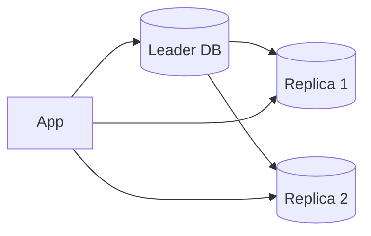

### Q: Sharding vs partitioning?

| Term | Meaning |
|------|---------|
| **Partitioning** | Splitting data (horizontal/vertical) — general term |
| **Sharding** | Horizontal partitioning across **multiple machines** |

### Q: Sharding strategies?

| Strategy | Example |
|----------|---------|
| **Hash-based** | `hash(user_id) % N` |
| **Range-based** | Users A-M on shard 1 |
| **Directory-based** | Lookup table for shard |
| **Geographic** | EU users on EU shard |

### Q: Consistent hashing?

**A:** Minimizes key redistribution when nodes added/removed. Used in distributed caches, CDNs, load balancers.

**Virtual nodes:** Better load distribution across physical servers.

### Q: Sharding challenges?

**A:** Cross-shard joins, rebalancing, hot shards, distributed transactions, global unique IDs.

### Q: Distributed ID generation?

| Approach | Pros | Cons |
|----------|------|------|
| **Auto-increment** | Simple | Single point, predictable |
| **UUID** | Distributed, no coordination | Not sortable, large |
| **Snowflake** | Sortable, distributed, 64-bit | Needs machine ID coordination |
| **DB sequence per shard** | Simple per shard | Range management |

---

## 10. Message Queues

### Q: Why message queues?

**A:** **Decouple** producers and consumers, **async** processing, **buffer** traffic spikes, **reliability** (retry, DLQ).

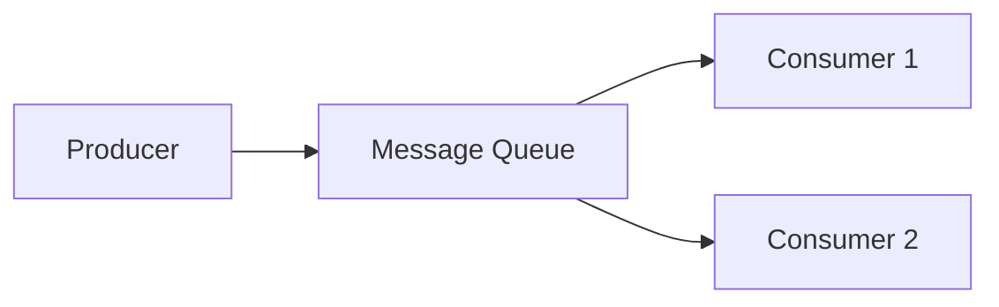

### Q: Kafka vs RabbitMQ vs SQS?

| Kafka | RabbitMQ | SQS |
|-------|----------|-----|
| Distributed log, high throughput | Traditional queue, flexible routing | Managed AWS queue |
| Replay messages | Message deleted after ack | At-least-once, simple |
| Event streaming | Task queues, RPC | Serverless, no ops |

### Q: Delivery guarantees?

| Guarantee | Meaning |
|-----------|---------|
| **At-most-once** | May lose messages |
| **At-least-once** | May duplicate (need idempotency) |
| **Exactly-once** | Hard; Kafka transactions + idempotent consumers |

### Q: Dead letter queue (DLQ)?

**A:** Failed messages after max retries go to DLQ for inspection — prevents poison messages blocking queue.

### Q: Pub/Sub vs Point-to-Point?

| Pub/Sub | Point-to-Point |
|---------|----------------|
| Multiple consumers get copy | One consumer per message |
| Fan-out events | Task distribution |
| Kafka topics | RabbitMQ queues |

---

## 11. Monolith vs Microservices

### Q: Monolith vs microservices?

| Monolith | Microservices |
|----------|---------------|
| Single deployable unit | Independently deployable services |
| Simple dev/debug | Team autonomy, tech diversity |
| Scales as one | Scale services independently |
| Tight coupling risk | Network complexity, distributed ops |

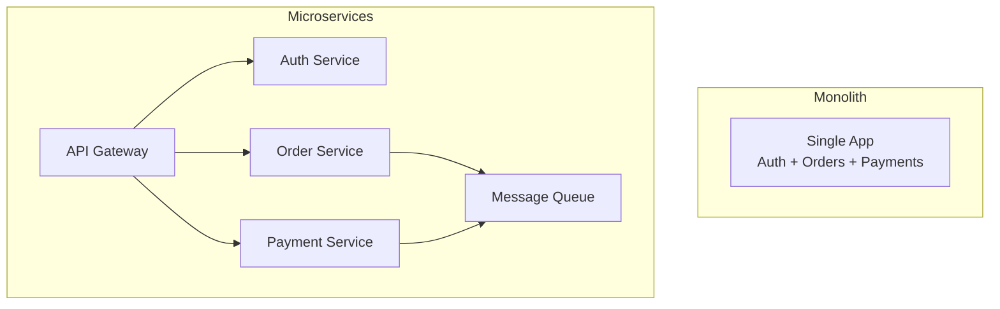

### Q: When to start with monolith?

**A:** Early product, small team, unclear domain boundaries. **Strangler fig pattern:** gradually extract services when boundaries are clear.

### Q: Microservices challenges?

**A:** Service discovery, distributed tracing, data consistency, network latency, deployment complexity, testing, versioning.

### Q: Modular monolith?

**A:** Single deployment with clear module boundaries — middle ground. Extract to microservices when scaling/team needs justify it.

---

## 12. API Gateway & Service Discovery

### Q: What is an API Gateway?

**A:** Single entry point for clients — routing, auth, rate limiting, SSL, request aggregation, protocol translation.

**Examples:** Kong, AWS API Gateway, Nginx, Envoy.

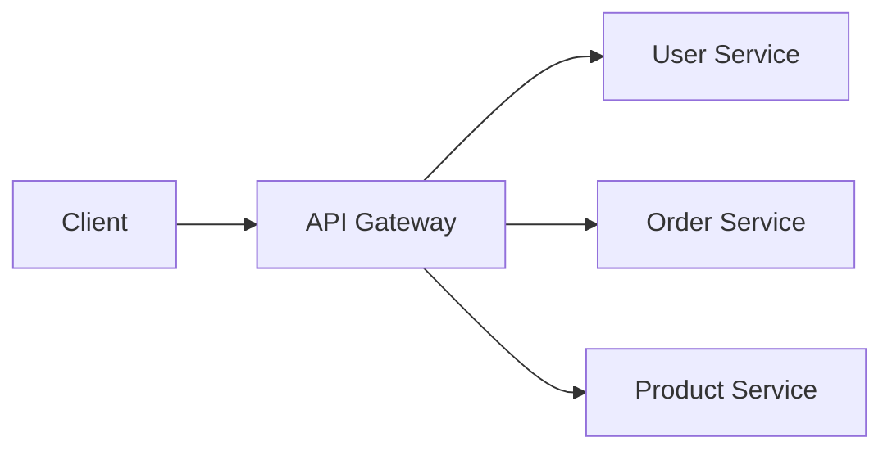

### Q: What is service discovery?

**A:** Services dynamically find each other in changing infrastructure (containers, autoscaling).

| Type | Example |
|------|---------|
| **Client-side** | Eureka — client queries registry |
| **Server-side** | K8s Service — LB routes to pods |

**Tools:** Consul, etcd, Kubernetes DNS, AWS Cloud Map.

### Q: BFF (Backend for Frontend)?

**A:** Separate API gateway per client type (web, mobile) — aggregates microservice calls into client-optimized responses.

---

## 13. Event-Driven Architecture

### Q: What is event-driven architecture (EDA)?

**A:** Components communicate by **producing and consuming events** asynchronously — loose coupling, scalability.

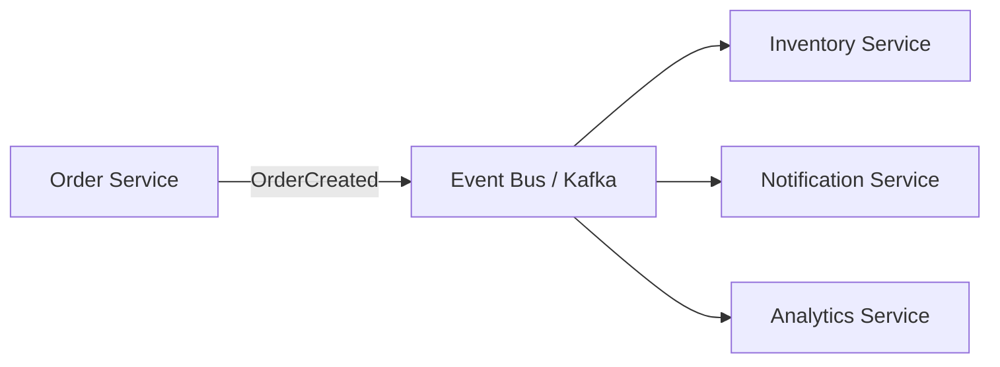

### Q: Event-driven vs request-response?

| Request-Response | Event-Driven |
|------------------|--------------|
| Synchronous, tight coupling | Async, loose coupling |
| Immediate response needed | Fire-and-forget, fan-out |
| REST/gRPC | Kafka, SNS/SQS, RabbitMQ |

### Q: Event sourcing?

**A:** Store state changes as sequence of events; current state = replay events. Enables audit trail, temporal queries. Pairs with CQRS.

### Q: Eventual consistency in EDA?

**A:** Services react to events asynchronously — temporary inconsistency between services is acceptable if business rules allow (e.g., inventory updates lag order confirmation by seconds).

---

## 14. CQRS & Saga Pattern

### Q: What is CQRS?

**A:** **Command Query Responsibility Segregation** — separate models for writes (commands) and reads (queries).

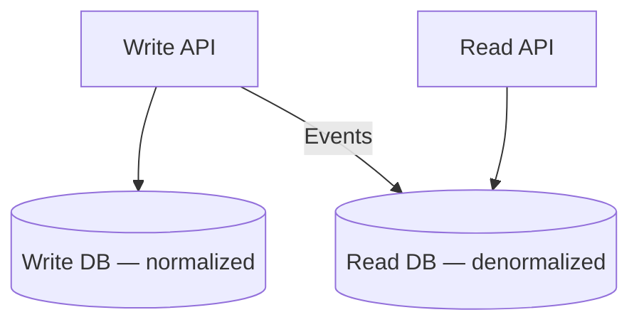

**Use when:** Read/write patterns differ greatly, complex queries, event sourcing.

### Q: What is the Saga pattern?

**A:** Manages **distributed transactions** as sequence of local transactions with **compensating actions** on failure.

| Type | Coordination |
|------|--------------|
| **Choreography** | Services react to events (decentralized) |
| **Orchestration** | Central saga coordinator (centralized) |

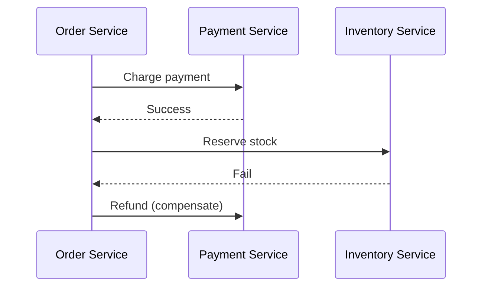

**Use cases:** E-commerce checkout, travel booking, food delivery order flow.

---

## 15. Distributed Transactions

### Q: What is a distributed transaction?

**A:** Transaction spanning multiple services/databases — all succeed or all roll back.

### Q: Two-Phase Commit (2PC)?

**A:**
1. **Prepare** — coordinator asks participants to lock and prepare
2. **Commit/Abort** — all vote; coordinator decides

**Problems:** Blocking, coordinator SPOF, doesn't scale well. Rarely used across microservices.

### Q: Alternatives to 2PC?

| Approach | Description |
|----------|-------------|
| **Saga** | Compensating transactions |
| **Outbox pattern** | Write DB + event in same local TX |
| **Idempotency** | Safe retries |
| **Eventual consistency** | Accept temporary inconsistency |

### Q: Outbox pattern?

**A:** Business data and outbound event written in **same local DB transaction**. Separate process polls outbox table and publishes to message broker — reliable event delivery.

### Q: Idempotency keys?

**A:** Client sends unique key per operation; server stores processed keys. Retries return same result without duplicate side effects. Critical for payments.

---

## 16. Real-Time Communication

### Q: WebSockets vs polling vs SSE?

| Method | Direction | Use Case |
|--------|-----------|----------|
| **Polling** | Client asks periodically | Simple, high latency |
| **Long Polling** | Server holds request until data | Near real-time, chat fallback |
| **SSE** | Server → Client (one-way) | Live feeds, notifications |
| **WebSockets** | Bidirectional | Chat, gaming, collaboration |

```mermaid
flowchart TB
    subgraph polling [Short Polling]
        C1[Client] -->|every 5s| S1[Server]
    end
    subgraph lp [Long Polling]
        C2[Client] -->|hold| S2[Server]
        S2 -->|data when ready| C2
    end
    subgraph sse [SSE]
        C3[Client] <--|HTTP stream| S3[Server]
    end
    subgraph ws [WebSocket]
        C4[Client] <-->|persistent| S4[Server]
    end
```

### Q: WebSocket scaling?

**A:** Sticky sessions or Redis pub/sub for cross-server message broadcast. Connection state is the challenge — use dedicated gateway (Socket.io + Redis adapter).

### Q: When to use SSE over WebSocket?

**A:** One-way server push (stock ticker, notification stream), simpler than WebSocket, works over HTTP/2, auto-reconnect built in.

### Q: gRPC streaming?

**A:** Bidirectional streaming over HTTP/2 with protobuf — good for internal microservice real-time communication, not browser-native without gRPC-Web.

---

## 17. Rate Limiting

### Q: Why rate limiting?

**A:** Prevent abuse, DDoS mitigation, fair usage, protect downstream services, cost control.

### Q: Rate limiting algorithms?

| Algorithm | Behavior |
|-----------|----------|
| **Token Bucket** | Burst allowed; steady rate refill |
| **Leaking Bucket** | Smooth output rate |
| **Fixed Window** | N requests per window (boundary spike issue) |
| **Sliding Window** | Smoother; rolling count |
| **Sliding Window Log** | Most accurate, more memory |

### Q: Where to implement?

**A:** API Gateway, Nginx (`limit_req`), Redis (distributed), middleware. Return `429 Too Many Requests` + `Retry-After` header.

### Q: Rate limit by?

**A:** IP, user ID, API key, endpoint — different tiers for free vs paid.

### Q: Distributed rate limiting with Redis?

```lua
-- Token bucket via Lua script for atomicity
-- Key: rate:{user_id}:{window}
-- INCR + EXPIRE or sorted set sliding window
```

---

## 18. Monitoring, Logging & Distributed Tracing

### Q: Three pillars of observability?

| Pillar | Purpose | Tools |
|--------|---------|-------|
| **Metrics** | Aggregated numbers over time | Prometheus, Grafana, CloudWatch |
| **Logs** | Discrete events | ELK, Loki, Splunk |
| **Traces** | Request path across services | Jaeger, Zipkin, OpenTelemetry |

### Q: What is distributed tracing?

**A:** Track a request across microservices with **trace ID** and **span ID** — identify latency bottlenecks.

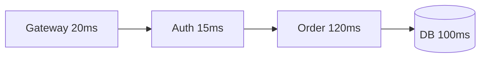

### Q: Key metrics to alert on?

**A:** Error rate, p99 latency, CPU/memory, queue depth, DB connections, cache hit ratio, disk usage, saturation (USE method).

### Q: Structured logging?

```json
{
  "level": "error",
  "trace_id": "abc123",
  "span_id": "def456",
  "service": "order",
  "msg": "Payment failed",
  "user_id": 42
}
```

Correlate logs with traces via shared `trace_id`.

### Q: SLI/SLO for system design?

**A:** Define SLIs (p99 latency, error rate, availability). Set SLOs (99.9% requests < 200ms). Error budget drives release velocity.

---

## 19. Design: URL Shortener

### Q: Requirements?

**Functional:** Shorten URL, redirect, optional custom alias, analytics, expiration.  
**Non-functional:** Low redirect latency (<100ms), highly available, 100M URLs/month.

### Q: Estimates?

- Write: 100M / 30 days ≈ **40 URLs/sec**
- Read: 100:1 ratio → **4,000 redirects/sec**
- Storage: 500 bytes × 100M × 5 years ≈ **250 GB** (manageable)

### Q: High-level design?

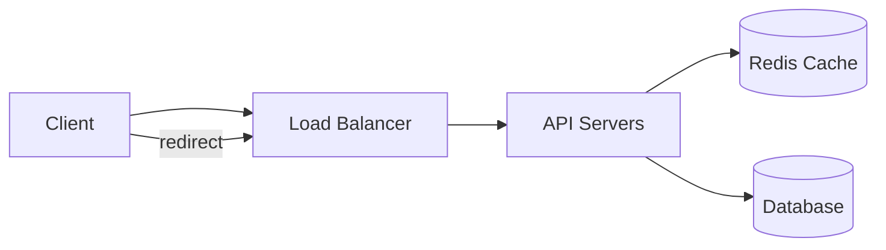

### Q: How to generate short code?

| Approach | Pros | Cons |
|----------|------|------|
| **Base62(auto-increment ID)** | Simple, no collision | Predictable |
| **Hash(MD5/SHA) + truncate** | Distributed | Collision risk |
| **Random + check** | Unpredictable | DB lookup on collision |
| **Snowflake + Base62** | Distributed, sortable | Needs ID service |

**Recommended:** Snowflake ID → Base62 encode → `bit.ly/abc12X`

### Q: Redirect flow?

1. `GET /abc12X` → check Redis
2. Cache miss → DB lookup → populate cache
3. **301** (permanent, cacheable) vs **302** (track analytics per click)

### Q: Database schema?

```sql
CREATE TABLE urls (
    id          BIGINT PRIMARY KEY,
    short_code  VARCHAR(10) UNIQUE,
    long_url    TEXT NOT NULL,
    user_id     BIGINT,
    created_at  TIMESTAMP,
    expires_at  TIMESTAMP
);
CREATE INDEX idx_short_code ON urls(short_code);
```

### Q: Analytics?

**A:** Async log click events to Kafka → aggregate in analytics DB. Don't block redirect path. Bloom filter to check if short code exists before DB hit.

---

## 20. Design: Chat App

### Q: Requirements?

1:1 and group chat, online status, read receipts, message history, media sharing, push notifications.  
Scale: 50M DAU, 500K concurrent connections.

### Q: High-level design?

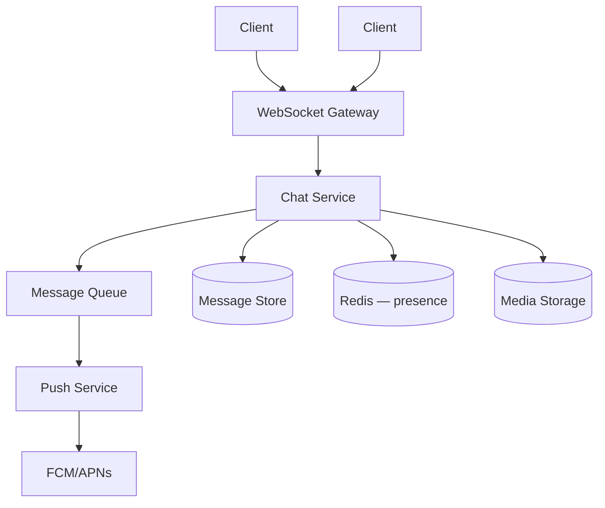

### Q: Message flow (1:1)?

1. User A sends message via WebSocket
2. Chat service persists to DB (Cassandra — write-heavy, time-series)
3. If User B online → push via WebSocket (Redis pub/sub across gateway nodes)
4. If offline → push notification via queue
5. ACK → update delivery status

### Q: Group chat?

**A:** Fan-out on write (small groups < 100) or fan-out on read (large channels like Telegram). Store one message; per-user inbox for delivery state.

### Q: Online presence?

**A:** Redis SET with heartbeat TTL (30s). User goes offline when TTL expires. WebSocket gateway updates on connect/disconnect.

### Q: Message ordering?

**A:** Per-conversation sequence number (monotonic). Client discards out-of-order or buffers. Partition Kafka by `conversation_id`.

### Q: Media messages?

**A:** Upload to S3 via pre-signed URL. Store metadata + URL in message. Thumbnail generation async via queue.

---

## 21. Design: Notification System

### Q: Requirements?

Send email, SMS, push, in-app notifications. Templates, user preferences, priority, retry, analytics.  
Volume: 10M notifications/day.

### Q: Architecture?

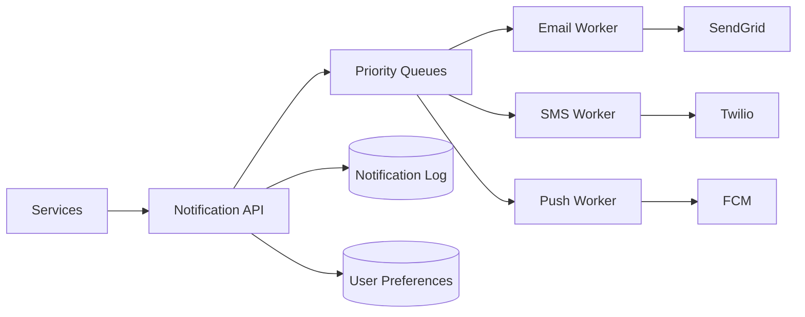

### Q: Key design decisions?

| Decision | Approach |
|----------|----------|
| **Async** | Always queue — don't block caller |
| **Priority** | OTP > transactional > marketing |
| **Idempotency** | Dedupe key per notification |
| **Preferences** | User opt-out per channel |
| **Templates** | Store in DB; render with variables |
| **Rate limit** | Per user to prevent spam |
| **Retry** | Exponential backoff; DLQ after N fails |

### Q: Fan-out for "notify all followers"?

**A:** For celebrity with 10M followers — don't fan-out on write. Store event; fan-out on read (pull) or hybrid with active follower cache.

### Q: Multi-channel delivery?

**A:** User preferences table (email: on, SMS: off). Template engine renders per channel. Single API call fans out to appropriate workers.

---

## 22. Design: Ride Sharing

### Q: Requirements?

Riders request rides, drivers accept, real-time location, ETA, pricing, payments, ratings.  
Scale: 1M rides/day, 100K concurrent drivers.

### Q: Core services?

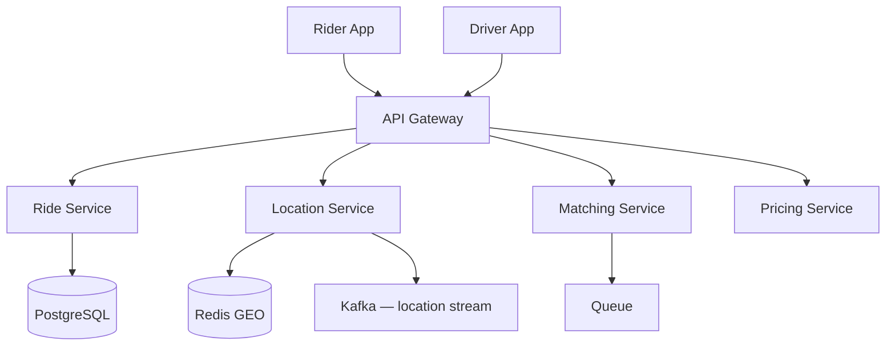

### Q: Driver-rider matching?

**A:**
1. Rider requests ride with pickup location
2. Query **Redis GEORADIUS** for drivers within 5km (updated every 3s)
3. Rank by distance, rating, acceptance rate
4. Send request to top N drivers via push/WebSocket
5. First accept wins — cancel others

### Q: Real-time location?

**A:** Drivers publish GPS every 3–5s to Location Service → Redis GEO + Kafka for analytics. WebSocket pushes driver position to rider.

### Q: Surge pricing?

**A:** Pricing service reads supply/demand ratio per geohash cell. Dynamic multiplier cached in Redis, updated every minute.

### Q: Ride state machine?

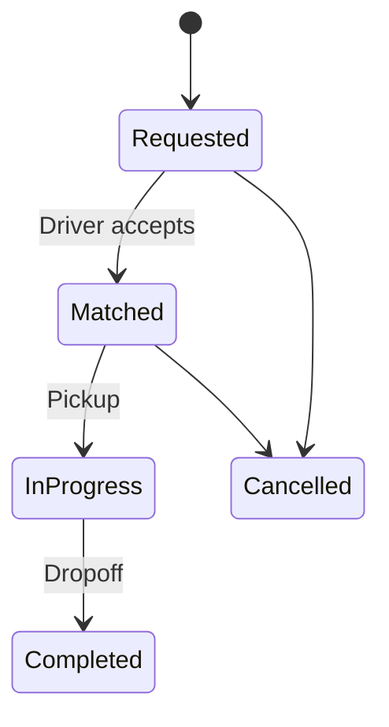

---

## 23. Design: Food Delivery

### Q: Requirements?

Browse restaurants, menu, cart, order, track delivery, payments, reviews.  
Peak: 50K orders/hour.

### Q: Architecture highlights?

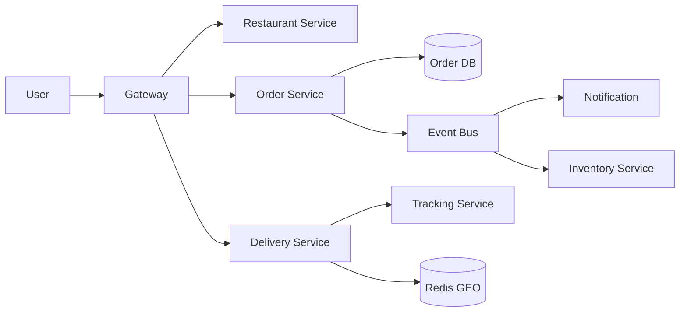

### Q: Order state machine (Saga)?

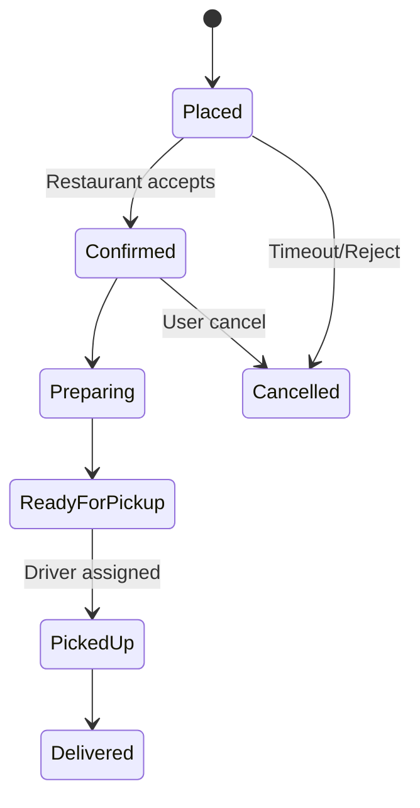

**Compensations:** Refund on cancel after payment; release inventory.

### Q: Search restaurants nearby?

**A:** Elasticsearch with geo_point filter + cuisine/rating facets. Cache popular queries in Redis.

### Q: Delivery ETA?

**A:** ML model on distance, traffic, restaurant prep time, driver availability. Update dynamically as state changes.

### Q: Inventory consistency?

**A:** Reserve inventory on order place (pessimistic lock or atomic decrement). Release on timeout/cancel via saga compensation.

---

## 24. Design: Video Streaming

### Q: Requirements?

Upload, transcode, stream (adaptive bitrate), resume playback, CDN delivery, analytics.  
Netflix-scale vs startup differs — clarify scope.

### Q: High-level design?

```mermaid
flowchart TB
    U[Uploader] --> Ingest[Ingest Service]
    Ingest --> S3[(Object Storage)]
    S3 --> TC[Transcode Workers]
    TC --> S3
    Viewer --> CDN[CDN Edge]
    CDN --> S3
    Viewer --> API[API Service]
    API --> Meta[(Metadata DB)]
```

### Q: Adaptive bitrate streaming (ABR)?

**A:** Video transcoded to multiple resolutions (360p, 720p, 1080p, 4K). **HLS/DASH** — chunked `.ts` or `.m4s` segments with manifest (`.m3u8`). Player switches quality based on bandwidth.

### Q: Upload flow?

1. Client requests pre-signed S3 URL
2. Direct upload to object storage (bypasses app server)
3. S3 event triggers transcode job queue
4. Workers produce renditions + manifest
5. CDN caches segments at edge

### Q: Resume playback?

**A:** Store watch position per user per video (Redis/DB). Client sends heartbeat every 30s.

### Q: Live streaming?

**A:** RTMP ingest → transcode → HLS segments with low latency (LL-HLS). WebSocket or HLS for playback. Higher complexity than VOD.

### Q: Content protection (DRM)?

**A:** Widevine/FairPlay encryption. License server validates subscription. Separate from core streaming architecture.

### Q: Recommendation system (Netflix-scale)?

**A:** Offline batch ML on viewing history → precompute recommendations → serve from cache. Real-time signals (current watch) blended at request time.

---

## 25. Scenario Questions

### Q1: "Design a rate limiter for a public API."

**A:** Token bucket in Redis (Lua script for atomicity). Key = `rate:{api_key}:{window}`. Return 429 + `Retry-After`. Distributed: Redis cluster. Mention sliding window for smoother limits. Different tiers per plan.

---

### Q2: "Your database is becoming a bottleneck. Options?"

**A:** (1) Query optimization + indexes, (2) Read replicas, (3) Redis cache for hot reads, (4) Denormalize, (5) Shard if write-bound, (6) CQRS for read-heavy, (7) Archive cold data.

---

### Q3: "How do you ensure exactly-once payment processing?"

**A:** Idempotency key per payment request. Store processed keys in DB. At-least-once delivery from queue + idempotent consumer. Saga with compensation for partial failures. Not true distributed TX — business-level idempotency.

---

### Q4: "Design Twitter news feed."

**A:** Clarify: home timeline (fan-out on write for normal users, fan-out on read for celebrities) vs search. Tweet service, timeline service (Redis sorted sets), fan-out workers, social graph in adjacency lists or graph DB.

---

### Q5: "Multi-region deployment — how?"

**A:** Active-passive (failover) or active-active (complex). Route 53 geo-routing. Replicate DB cross-region (async). Conflict resolution for writes. CDN global. Consider data residency (GDPR).

---

### Q6: "Service A needs data from B and C. Sequential or parallel?"

**A:** Parallel async calls (Promise.all / futures) if independent. API Gateway aggregation pattern. Set timeouts + circuit breakers. Fallback/degrade if non-critical service fails.

---

### Q7: "How does Uber handle millions of location updates?"

**A:** High-write location stream (Kafka). Redis GEO for current positions (latest only). Downsample for map display. Separate hot path (matching) from cold path (analytics/ML).

---

### Q8: "Monolith to microservices — first service to extract?"

**A:** Extract service with clearest boundary, independent scaling need, or different release cadence — often notifications, search, or payments. Use strangler fig; don't big-bang rewrite.

---

### Q9: "Design a distributed cache."

**A:** Consistent hashing for key distribution. Replication for availability. Cache-aside pattern. TTL + eviction (LRU). Handle cache stampede with single-flight. Redis Cluster or Memcached with client-side sharding.

---

### Q10: "How do you design for 10x traffic spike (Black Friday)?"

**A:** Auto-scale app servers, pre-warm cache, CDN for static, queue async work, rate limit non-critical features, load test beforehand, circuit breakers, degrade gracefully (disable recommendations), read replicas.

---

### Q11: "Design a distributed job scheduler."

**A:** Leader election (etcd/ZooKeeper) for scheduler. Job queue (Kafka/SQS). Workers pull jobs. At-least-once + idempotent execution. Cron via time-wheel or delayed queue. Dead letter for failures.

---

### Q12: "How do you handle duplicate messages in Kafka?"

**A:** Idempotent consumer (track processed message IDs). Business-level idempotency keys. Exactly-once semantics with Kafka transactions (complex). Design for at-least-once + idempotent handlers.

---

## 26. Cheat Sheet

### Back-of-Envelope

```
1 day ≈ 10⁵ seconds
1 year ≈ 3 × 10⁷ seconds
1 KB → 1 MB → 1 GB → 1 TB (powers of 1024 or 1000 — state which)
QPS = requests/day ÷ 86400
Storage = records × size × retention
Bandwidth = QPS × avg response size
```

### CAP Quick Pick

```
Partition happens → choose CP or AP
CP: banks, inventory locks, leader election
AP: social feeds, likes, carts, DNS
```

### Scaling Checklist

```
1. Stateless app servers
2. Load balancer + health checks
3. Cache (Redis)
4. CDN (static)
5. Read replicas
6. Sharding (writes)
7. Async queues
8. Auto-scale
9. Monitoring + alerting
```

### Communication Pick

| Need | Choice |
|------|--------|
| Simple CRUD | REST |
| Internal microservices | gRPC |
| Flexible client queries | GraphQL |
| Real-time bidirectional | WebSocket |
| Server push one-way | SSE |
| Async decoupling | Kafka / SQS |
| Task queue | RabbitMQ / SQS |

### Consistency Patterns

```
Strong     → Single DB transaction
Eventual   → Replicas + cache TTL
Saga       → Distributed workflow + compensate
Outbox     → Reliable event publish
Idempotency → Safe retries
```

### Classic Designs at a Glance

| System | Key Techniques |
|--------|----------------|
| **URL Shortener** | Base62, Redis cache, 301 redirect, Snowflake IDs |
| **Chat** | WebSocket, Kafka, Cassandra, presence in Redis |
| **Notifications** | Priority queues, templates, idempotency |
| **Ride sharing** | Redis GEO, matching, surge pricing, location stream |
| **Food delivery** | Saga, state machine, geo search, inventory lock |
| **Video streaming** | S3, transcode, HLS/DASH, CDN, ABR |

### Rate Limiting

```
Token bucket → allows burst
Sliding window → smooth
Redis + Lua → distributed atomic
429 + Retry-After header
```

### Observability

```
Metrics  → Prometheus + Grafana
Logs     → ELK / structured JSON + trace_id
Traces   → OpenTelemetry + Jaeger
Alert on → error rate, p99, saturation
```

### Interview Phrases

- "Let me clarify functional and non-functional requirements"
- "Back-of-envelope: X QPS, Y GB storage"
- "I'll start with a high-level diagram"
- "Bottleneck is likely here — I'd add cache/replicas"
- "Trade-off: consistency vs availability"
- "For failure: retry, circuit breaker, DLQ"
- "I'd use idempotency keys for safe retries"

### System Design Template

```
1. Requirements (5 min)
   - Functional features
   - Scale (DAU, QPS, storage)
   - Latency, availability, consistency

2. API Design
   - Key endpoints
   - Request/response

3. Data Model
   - Tables/collections
   - Indexes

4. High-Level Diagram
   - Client → LB → Services → DB/Cache/Queue

5. Deep Dive
   - Hot path
   - Scaling strategy
   - Failure modes

6. Trade-offs & Improvements
```

---

*End of System Design Guide*
