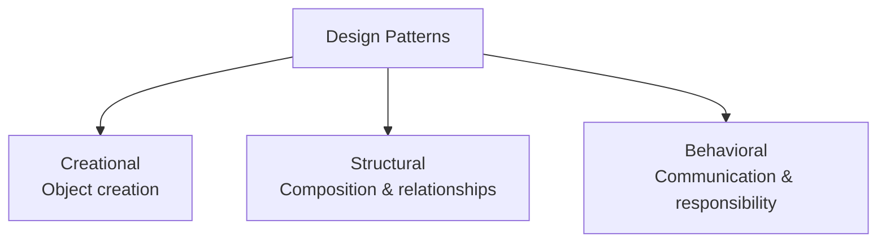
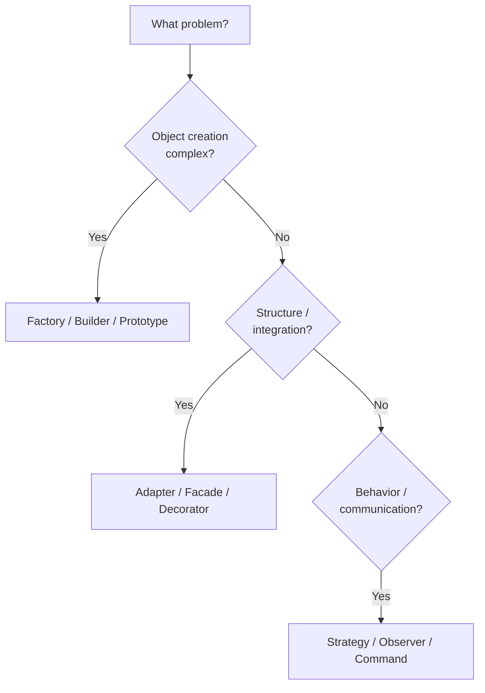
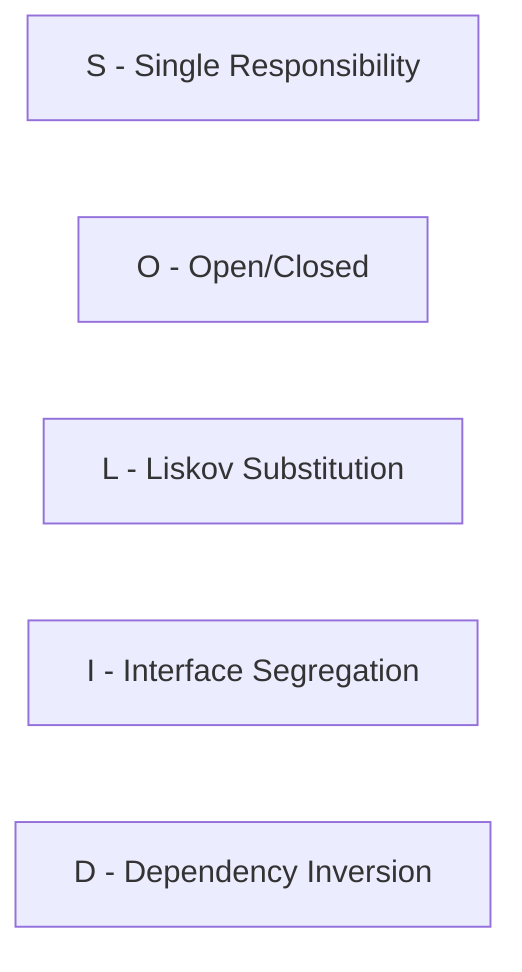
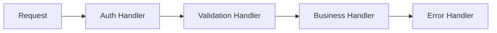
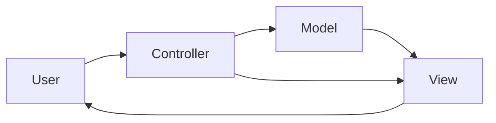
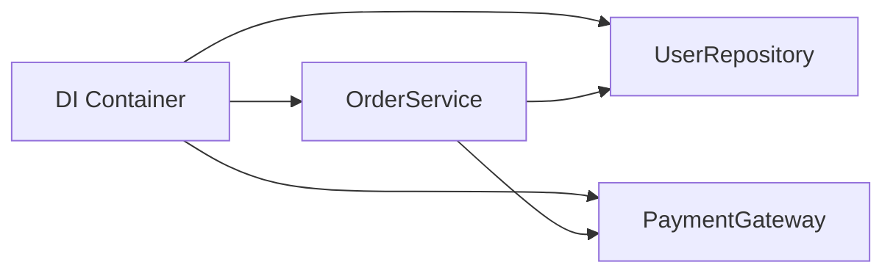
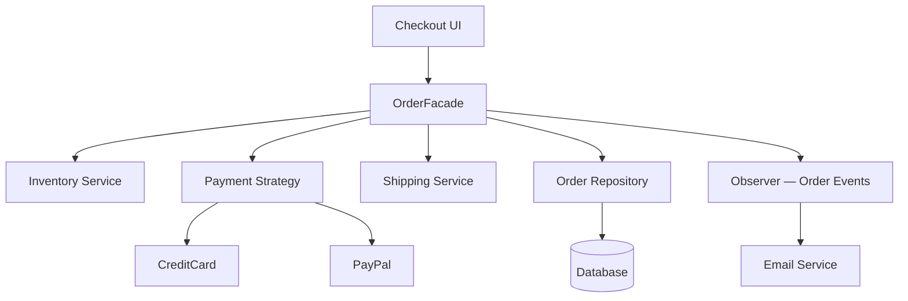
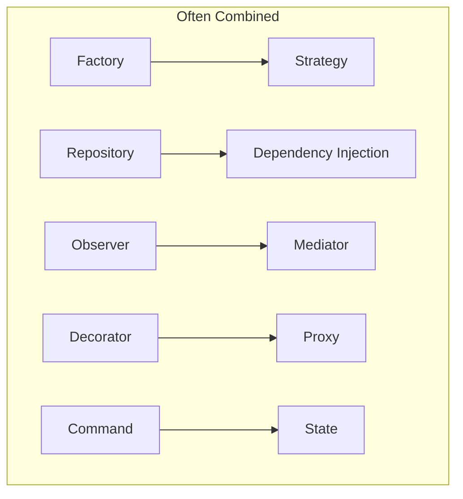

# Design Patterns — Comprehensive Interview Preparation Guide

> **How to use this guide:** Understand *intent* and *trade-offs*, not just definitions. Practice mapping patterns to real projects, then drill **Scenario Questions** and the **Cheat Sheet**.

---

## Table of Contents

1. [What Are Design Patterns](#1-what-are-design-patterns)
2. [SOLID Principles](#2-solid-principles)
3. [Creational Patterns](#3-creational-patterns)
4. [Structural Patterns](#4-structural-patterns)
5. [Behavioral Patterns](#5-behavioral-patterns)
6. [MVC Pattern](#6-mvc-pattern)
7. [Repository Pattern](#7-repository-pattern)
8. [Dependency Injection](#8-dependency-injection)
9. [Real Project Examples](#9-real-project-examples)
10. [Best Practices](#10-best-practices)
11. [Scenario Questions](#11-scenario-questions)
12. [Cheat Sheet](#12-cheat-sheet)

---

## 1. What Are Design Patterns

### Q: What is a design pattern?

**A:** A **reusable solution** to a recurring problem in software design. It is not code you copy-paste — it is a **template** describing objects, responsibilities, and interactions that have proven effective.

### Q: Who introduced design patterns to software?

**A:** The Gang of Four (GoF) — Gamma, Helm, Johnson, Vlissides — in *Design Patterns: Elements of Reusable Object-Oriented Software* (1994). They cataloged 23 classic patterns.

### Q: Why use design patterns?

**A:**
- Shared vocabulary in teams ("use a Strategy here")
- Proven structures reduce design mistakes
- Easier maintenance and testing when applied appropriately
- Interview signal: you think in abstractions and trade-offs

### Q: When NOT to use a pattern?

**A:** When the problem is simple, the pattern adds unnecessary indirection, or you're forcing a pattern without a real problem. **YAGNI** — You Aren't Gonna Need It.

### Q: Pattern categories overview?



| Category | Question Answered |
|----------|-----------------|
| **Creational** | How are objects created? |
| **Structural** | How are classes/objects composed? |
| **Behavioral** | How do objects communicate and distribute responsibility? |

### Q: Design patterns vs design principles?

**A:** **Principles** (SOLID, DRY, KISS) are guidelines. **Patterns** are concrete structural solutions. Principles inform when and how to apply patterns.

### Q: How to choose a pattern?



---

## 2. SOLID Principles

### Q: What is SOLID?

**A:** Five OOP principles for maintainable, flexible code.



### Q: Single Responsibility Principle (SRP)?

**A:** A class/module should have **one reason to change** — one job.

```javascript
// Bad — User class does auth + email + DB
class User {
  save() { /* DB */ }
  sendWelcomeEmail() { /* SMTP */ }
}

// Good — separate concerns
class UserRepository { save(user) { } }
class EmailService { sendWelcome(user) { } }
```

### Q: Open/Closed Principle (OCP)?

**A:** Open for **extension**, closed for **modification**. Add behavior via new code, not by editing existing stable code.

```javascript
// Extend with new strategies without changing processor
class PaymentProcessor {
  process(payment, strategy) {
    return strategy.charge(payment);
  }
}
```

### Q: Liskov Substitution Principle (LSP)?

**A:** Subtypes must be substitutable for their base type without breaking behavior.

```javascript
// Violation: Square extends Rectangle but breaks setWidth/setHeight contract
// Fix: don't inherit; use shared interface or composition
interface Shape {
  area(): number;
}
```

### Q: Interface Segregation Principle (ISP)?

**A:** Clients shouldn't depend on interfaces they don't use. Prefer small, focused interfaces.

```typescript
// Bad
interface Worker { work(); eat(); sleep(); }

// Good
interface Workable { work(); }
interface Feedable { eat(); }
```

### Q: Dependency Inversion Principle (DIP)?

**A:** High-level modules depend on **abstractions**, not concrete implementations.

```javascript
// High-level OrderService depends on PaymentGateway interface
class OrderService {
  constructor(paymentGateway) { this.payment = paymentGateway; }
}
```

### Q: SOLID in functional / React code?

**A:** SRP → one hook/component per concern. OCP → composition over modification. DIP → inject services via context/props. LSP/ISP apply to TypeScript interfaces and component contracts.

---

## 3. Creational Patterns

### Q: Overview of creational patterns?

| Pattern | Purpose |
|---------|---------|
| **Singleton** | One instance globally |
| **Factory Method** | Subclass decides which class to instantiate |
| **Abstract Factory** | Families of related objects |
| **Builder** | Step-by-step complex object construction |
| **Prototype** | Clone existing objects |

---

### Singleton

### Q: What is Singleton?

**A:** Ensures a class has only **one instance** and provides global access.

```javascript
class Database {
  static #instance;
  constructor() {
    if (Database.#instance) return Database.#instance;
    Database.#instance = this;
  }
}
// Modern JS: module singleton — db.js exports single pool
```

**Use cases:** DB connection pool, logger, config manager, app store (Redux).

**Downsides:** Hidden global state, hard to test, violates SRP. Prefer DI over Singleton in most apps.

---

### Factory Method

### Q: What is Factory Method?

**A:** Define an interface for creating objects; let **subclasses** decide which class to instantiate.

```javascript
class NotificationFactory {
  static create(type) {
    switch (type) {
      case 'email': return new EmailNotification();
      case 'sms': return new SmsNotification();
      case 'push': return new PushNotification();
      default: throw new Error('Unknown type');
    }
  }
}
```

**Use cases:** Payment providers, UI component factories, parser selection by file type.

---

### Abstract Factory

### Q: Factory Method vs Abstract Factory?

| Factory Method | Abstract Factory |
|----------------|------------------|
| One product type | **Family** of related products |
| One factory method | Multiple factory methods |

```javascript
// Abstract Factory — UI theme families
class DarkThemeFactory {
  createButton() { return new DarkButton(); }
  createCheckbox() { return new DarkCheckbox(); }
}
class LightThemeFactory {
  createButton() { return new LightButton(); }
  createCheckbox() { return new LightCheckbox(); }
}
```

**Use cases:** Cross-platform UI kits, themed component libraries, OS-specific APIs.

---

### Builder

### Q: What is Builder?

**A:** Constructs complex objects **step by step**, separating construction from representation.

```javascript
class QueryBuilder {
  #query = { table: '', where: [], order: '' };
  from(table) { this.#query.table = table; return this; }
  where(cond) { this.#query.where.push(cond); return this; }
  orderBy(col) { this.#query.order = col; return this; }
  build() { return this.#query; }
}

const q = new QueryBuilder().from('users').where('active=1').orderBy('name').build();
```

**Use cases:** SQL/HTTP request builders, config objects with many optional fields.

**vs Factory:** Builder focuses on **stepwise assembly**; Factory focuses on **which type** to create.

---

### Prototype

### Q: What is Prototype?

**A:** Create new objects by **cloning** an existing instance instead of constructing from scratch.

```javascript
const template = { theme: 'dark', locale: 'en', features: ['auth'] };
const userConfig = { ...template, locale: 'fr', features: [...template.features, 'billing'] };
// JS: Object.create(), structuredClone(), spread
```

**Use cases:** Expensive object creation, game entities, document templates, Redux state updates.

---

## 4. Structural Patterns

### Q: Overview of structural patterns?

| Pattern | Purpose |
|---------|---------|
| **Adapter** | Make incompatible interfaces work together |
| **Bridge** | Separate abstraction from implementation |
| **Composite** | Tree structures treated uniformly |
| **Decorator** | Add behavior dynamically |
| **Facade** | Simplified interface to complex subsystem |
| **Flyweight** | Share state to support many fine-grained objects |
| **Proxy** | Surrogate controlling access to another object |

---

### Adapter

### Q: What is Adapter?

**A:** Wraps an incompatible interface so clients can use it as expected.

```javascript
class XmlToJsonAdapter {
  constructor(xmlService) { this.xml = xmlService; }
  getUser(id) {
    const xml = this.xml.fetchUserXml(id);
    return parseXmlToJson(xml);
  }
}
```

**Use cases:** Third-party SDK integration, legacy system wrappers, normalizing APIs.

**Class Adapter vs Object Adapter:** Object adapter (composition) is more flexible; class adapter (inheritance) is less common in JS.

---

### Bridge

### Q: Adapter vs Bridge?

| Adapter | Bridge |
|---------|--------|
| Fix incompatibility **after** design | Plan separation **upfront** |
| Makes two things work | Decouples abstraction + implementation |

```javascript
class Circle {
  constructor(renderer) { this.renderer = renderer; }
  draw() { this.renderer.renderCircle(this); }
}
// Renderer: SVGRenderer, CanvasRenderer — swap independently
```

**Use cases:** Cross-platform rendering, device drivers, notification channels × message types.

---

### Composite

### Q: What is Composite?

**A:** Compose objects into **tree structures**; treat individual and groups uniformly.

```javascript
class File {
  constructor(name) { this.name = name; }
  getSize() { return this.size; }
}
class Folder {
  constructor(name) { this.name = name; this.children = []; }
  add(child) { this.children.push(child); }
  getSize() { return this.children.reduce((s, c) => s + c.getSize(), 0); }
}
```

**Use cases:** File systems, UI component trees (React), org charts, menu systems.

---

### Decorator

### Q: What is Decorator?

**A:** Attach **additional responsibilities** to an object dynamically without subclassing.

```javascript
// HOC in React is a Decorator
function withAuth(Component) {
  return function Authenticated(props) {
    if (!isLoggedIn()) return <Login />;
    return <Component {...props} />;
  };
}

// Middleware / logging wrapper
function logged(fn) {
  return (...args) => {
    console.log('calling', fn.name);
    return fn(...args);
  };
}
```

**Use cases:** Middleware (Express), HOCs, input validation wrappers, caching wrappers.

**vs Inheritance:** Decorator composes at runtime; inheritance is compile-time fixed.

---

### Facade

### Q: What is Facade?

**A:** Provides a **unified simplified interface** to a complex subsystem.

```javascript
class OrderFacade {
  constructor(inventory, payment, shipping) {
    this.inventory = inventory;
    this.payment = payment;
    this.shipping = shipping;
  }
  async placeOrder(order) {
    await this.inventory.reserve(order.items);
    await this.payment.charge(order.total);
    await this.shipping.dispatch(order);
    return { status: 'confirmed' };
  }
}
```

**Use cases:** API gateways, library wrappers (`axios`), onboarding flows orchestrating multiple services.

---

### Flyweight

### Q: What is Flyweight?

**A:** Share **intrinsic state** among many objects to reduce memory.

```javascript
const iconCache = new Map();
function getIcon(type) {
  if (!iconCache.has(type)) iconCache.set(type, loadIcon(type));
  return iconCache.get(type);
}
// Each map marker shares icon; unique position is extrinsic state
```

**Use cases:** Text editors (character formatting), game sprites, map markers, string interning.

**Intrinsic vs extrinsic:** Intrinsic = shared (icon glyph); extrinsic = unique per instance (x, y position).

---

### Proxy

### Q: What is Proxy?

**A:** Surrogate that **controls access** to another object (lazy loading, caching, auth, logging).

```javascript
const handler = {
  get(target, prop) {
    console.log(`Accessing ${prop}`);
    return target[prop];
  }
};
const proxied = new Proxy(user, handler);
```

**Types:**
- **Virtual Proxy** — lazy-load heavy object
- **Protection Proxy** — auth check before method call
- **Caching Proxy** — memoize expensive calls

**Use cases:** Lazy loading, caching, access control, Vue 3 reactivity (`Proxy`).

**vs Decorator:** Proxy controls *access*; Decorator adds *behavior*.

---

## 5. Behavioral Patterns

### Q: Overview of behavioral patterns?

| Pattern | Purpose |
|---------|---------|
| **Observer** | One-to-many dependency / pub-sub |
| **Strategy** | Interchangeable algorithms |
| **Command** | Encapsulate request as object |
| **Chain of Responsibility** | Pass request along handler chain |
| **State** | Object behavior changes with internal state |
| **Template Method** | Skeleton algorithm, subclasses fill steps |
| **Mediator** | Centralized communication hub |
| **Visitor** | Add operations without changing classes |
| **Iterator** | Sequential access without exposing internals |

---

### Observer

### Q: What is Observer?

**A:** Subject maintains list of observers; notifies them on state change.

```javascript
class EventEmitter {
  #listeners = {};
  on(event, fn) { (this.#listeners[event] ??= []).push(fn); }
  emit(event, data) { this.#listeners[event]?.forEach(fn => fn(data)); }
}
```

**Use cases:** Event systems, pub/sub (Redis, RabbitMQ), React state, DOM events.

**Push vs pull:** Push sends full data to observers; pull lets observers query subject state.

---

### Strategy

### Q: What is Strategy?

**A:** Define family of **interchangeable algorithms**; select at runtime.

```javascript
const strategies = {
  creditcard: (amount) => chargeCard(amount),
  paypal: (amount) => chargePayPal(amount),
  crypto: (amount) => chargeCrypto(amount),
};

function checkout(method, amount) {
  return strategies[method](amount);
}
```

**Use cases:** Payment methods, sorting algorithms, pricing rules, validation strategies.

**vs State:** Strategy is chosen **externally**; State transitions happen **internally**.

---

### Command

### Q: What is Command?

**A:** Encapsulate a request as an object — enables undo, queue, logging.

```javascript
class AddTextCommand {
  constructor(editor, text) { this.editor = editor; this.text = text; }
  execute() { this.editor.insert(this.text); }
  undo() { this.editor.delete(this.text.length); }
}

const history = [];
function run(cmd) { cmd.execute(); history.push(cmd); }
function undo() { history.pop()?.undo(); }
```

**Use cases:** Undo/redo, job queues, macro recording, Redux actions, transaction logs.

---

### Chain of Responsibility

### Q: What is Chain of Responsibility?

**A:** Pass request along a **chain of handlers** until one handles it.



```javascript
// Express middleware chain
app.use(authMiddleware);
app.use(validateMiddleware);
app.use(businessLogic);
```

**Use cases:** Middleware pipelines, logging filters, approval workflows, exception handling chains.

---

### State

### Q: What is State?

**A:** Object alters behavior when its **internal state** changes; appears to change class.

```javascript
class Order {
  constructor() { this.state = new PendingState(this); }
  setState(state) { this.state = state; }
  ship() { this.state.ship(); }
  cancel() { this.state.cancel(); }
}

class PendingState {
  constructor(order) { this.order = order; }
  ship() { this.order.setState(new ShippedState(this.order)); }
  cancel() { /* allow */ }
}
class ShippedState {
  cancel() { throw new Error('Cannot cancel shipped order'); }
}
```

**Use cases:** Order workflows, TCP connection states, media players, finite state machines (XState).

---

### Template Method

### Q: What is Template Method?

**A:** Base class defines **skeleton algorithm**; subclasses override specific steps.

```javascript
class DataExporter {
  export() {
    const data = this.fetchData();
    const formatted = this.format(data);
    return this.send(formatted);
  }
  fetchData() { throw new Error('implement'); }
  format(data) { throw new Error('implement'); }
  send(data) { /* default: download */ }
}

class CsvExporter extends DataExporter {
  fetchData() { return db.query(); }
  format(data) { return toCsv(data); }
}
```

**Use cases:** ETL pipelines, test frameworks (`beforeEach`/`afterEach`), React lifecycle (class components).

**vs Strategy:** Template Method uses **inheritance** (fixed skeleton); Strategy uses **composition** (swappable algorithm).

---

### Mediator

### Q: What is Mediator?

**A:** Central object coordinates communication between components — reduces direct coupling.

```javascript
class ChatRoom {
  #users = [];
  join(user) { this.#users.push(user); user.room = this; }
  send(message, from) {
    this.#users.filter(u => u !== from).forEach(u => u.receive(message));
  }
}
```

**Use cases:** Chat rooms, air traffic control, Redux (store mediates components), dialog coordinators.

**vs Observer:** Observer is many-to-many broadcast; Mediator is **hub-and-spoke**.

---

### Visitor

### Q: What is Visitor?

**A:** Add new operations to object structure **without modifying** element classes.

```javascript
class AreaVisitor {
  visitCircle(c) { return Math.PI * c.radius ** 2; }
  visitSquare(s) { return s.side ** 2; }
}

// Each shape implements accept(visitor) { return visitor.visitCircle(this); }
```

**Use cases:** AST traversal (Babel, ESLint), compiler passes, exporting multiple formats from document tree.

**Downside:** Hard to add new element types (violates OCP for elements). **Double dispatch** required.

---

### Iterator

### Q: What is Iterator?

**A:** Provides sequential access to collection elements without exposing internal structure.

```javascript
for (const item of collection) { }
const iter = collection[Symbol.iterator]();
// Custom: BinaryTree inorder iterator, paginated DB cursor
```

**Use cases:** Custom collections, lazy sequences, pagination iterators, database cursors.

---

## 6. MVC Pattern

### Q: What is MVC?

**A:** **Model-View-Controller** — separates data (Model), presentation (View), and user input logic (Controller).



| Layer | Responsibility |
|-------|----------------|
| **Model** | Data, business rules, state |
| **View** | UI rendering, display |
| **Controller** | Handles input, updates model, selects view |

### Q: MVC in different frameworks?

| Framework | Interpretation |
|-----------|----------------|
| **Ruby on Rails** | Classic MVC |
| **Spring MVC** | Controller → Service → Repository |
| **React** | View; state = Model; handlers = Controller-ish |
| **Angular** | Components + Services (MVVM-like) |
| **Next.js** | Pages (View) + API routes (Controller) + DB (Model) |

### Q: MVC vs MVP vs MVVM?

| Pattern | View updates via |
|---------|------------------|
| **MVC** | Controller pushes to View |
| **MVP** | Presenter pushes to passive View |
| **MVVM** | Data binding (ViewModel ↔ View) |

### Q: Is React MVC?

**A:** React is primarily the **View** layer. With hooks/context/Redux, you separate concerns similarly: components (View), state/actions (Model), event handlers (Controller-like). It's **MVC-inspired**, not strict MVC.

---

## 7. Repository Pattern

### Q: What is the Repository pattern?

**A:** Mediates between domain/business layer and data mapping — **collection-like interface** for domain objects. Hides persistence details (SQL, MongoDB, API).

```javascript
class UserRepository {
  constructor(db) { this.db = db; }
  async findById(id) {
    return this.db.query('SELECT * FROM users WHERE id=$1', [id]);
  }
  async findByEmail(email) {
    return this.db.query('SELECT * FROM users WHERE email=$1', [email]);
  }
  async save(user) { /* INSERT or UPDATE */ }
  async delete(id) { /* DELETE */ }
}

class UserService {
  constructor(userRepo) { this.users = userRepo; }
  async getProfile(id) {
    const user = await this.users.findById(id);
    return { name: user.name, email: user.email };
  }
}
```

### Q: Repository vs DAO?

| Repository | DAO (Data Access Object) |
|------------|--------------------------|
| Domain-centric, collection metaphor | CRUD-focused, table-centric |
| `findByEmail()`, `save()` | `insert()`, `update()`, `delete()` |

### Q: Repository vs Active Record?

| Repository | Active Record |
|------------|---------------|
| Separate persistence layer | Model includes DB methods (Rails, Prisma) |
| Better for complex domains | Simpler for CRUD apps |

### Q: Benefits?

**A:** Testability (mock repository), swap data sources, single place for queries, keeps business logic free of SQL/ORM details.

---

## 8. Dependency Injection

### Q: What is Dependency Injection (DI)?

**A:** Objects receive dependencies from **outside** rather than creating them internally. Implements Dependency Inversion Principle.



### Q: DI types?

| Type | Example |
|------|---------|
| **Constructor** | `new Service(repo)` — most common |
| **Setter** | `service.setRepo(repo)` |
| **Interface** | Inject via interface/abstract class |

```javascript
// Without DI — tight coupling
class OrderService {
  constructor() { this.db = new PostgresConnection(); } // bad
}

// With DI
class OrderService {
  constructor(orderRepo, paymentGateway) {
    this.orders = orderRepo;
    this.payment = paymentGateway;
  }
}
```

### Q: DI frameworks?

**A:** NestJS (built-in), Angular, Spring, InversifyJS. Manual constructor injection works fine for smaller apps.

### Q: DI vs Service Locator?

**A:** DI **pushes** dependencies in (explicit). Service Locator **pulls** from registry (hidden dependency). Prefer DI for testability and clarity.

### Q: Testing with DI?

```javascript
const mockRepo = { findById: jest.fn().mockResolvedValue({ id: 1, name: 'Test' }) };
const service = new UserService(mockRepo);
await service.getProfile(1);
expect(mockRepo.findById).toHaveBeenCalledWith(1);
```

---

## 9. Real Project Examples

### Q: Map patterns to a typical full-stack app?

| Feature | Pattern |
|---------|---------|
| Express middleware | Chain of Responsibility |
| Redux / Zustand | Observer + Command |
| React HOC / hooks wrapper | Decorator |
| `axios` instance + interceptors | Decorator + Proxy |
| Payment methods | Strategy |
| Notification (email/SMS/push) | Factory + Strategy |
| Order status flow | State |
| DB access layer | Repository |
| NestJS modules | DI + Facade |
| Event bus (Socket.io) | Observer |
| API client for legacy SOAP | Adapter |
| Long form wizard | Builder |
| File explorer UI | Composite |
| Route-based code split | Factory |
| Config singleton | Singleton (module) |
| Bull job queue | Command |
| React Context | Mediator-like |

### Q: E-commerce checkout example?



- **Facade** — `placeOrder()` orchestrates subsystems
- **Strategy** — payment method selection
- **Repository** — persist order
- **Observer** — notify user on status change
- **Command** — order actions with undo (cancel before ship)
- **State** — order lifecycle (pending → paid → shipped)

### Q: React + Node notification system?

- **Factory** — create Email/SMS/Push notifiers
- **Observer** — WebSocket pushes to clients
- **Queue + Command** — async job processing (Bull/RabbitMQ)
- **Proxy** — rate-limit external SMS API calls
- **Adapter** — normalize Twilio vs SendGrid responses

### Q: Authentication system patterns?

- **Strategy** — JWT vs session vs OAuth providers
- **Decorator** — auth middleware wrapping routes
- **Proxy** — gate access to protected resources
- **Singleton** — token blacklist store (prefer Redis + DI)

---

## 10. Best Practices

### Q: Design pattern best practices?

1. **Name the problem first** — pattern follows problem, not vice versa
2. **Favor composition over inheritance**
3. **Keep patterns shallow** — avoid pattern-on-pattern complexity
4. **Use DI** instead of Singleton for testability
5. **Document why** you chose a pattern in code reviews
6. **Refactor toward patterns** when duplication or coupling appears
7. **Know trade-offs** — every pattern adds indirection

### Q: Common mistakes?

| Mistake | Fix |
|---------|-----|
| Singleton everywhere | DI + module scope |
| God Object Facade | Split responsibilities |
| Strategy explosion | Registry/map of strategies |
| Over-abstracting early | YAGNI until pain is real |
| Confusing Adapter vs Facade | Adapter = interface fix; Facade = simplify many APIs |
| Confusing Decorator vs Proxy | Decorator = add behavior; Proxy = control access |

### Q: Anti-patterns to know?

| Anti-pattern | Problem |
|--------------|---------|
| **God Object** | One class does everything |
| **Spaghetti Code** | No structure, tangled dependencies |
| **Golden Hammer** | Force one pattern everywhere |
| **Anemic Domain Model** | Logic in services, entities are dumb data bags |

### Q: How to discuss patterns in interviews?

**A:** Use **STAR**: Situation → Problem → Pattern → Result. Always mention **trade-offs** and **alternatives**.

---

## 11. Scenario Questions

### Q1: "You need to support multiple payment gateways without if/else everywhere."

**A:** **Strategy pattern** — define `PaymentStrategy` interface; inject selected strategy at runtime. Register strategies in a map. Open/Closed: add new gateway without modifying checkout logic.

---

### Q2: "Third-party weather API returns different format than your app expects."

**A:** **Adapter** — wrap external API, expose internal `WeatherService.getForecast(city)` returning your domain model.

---

### Q3: "Users complain the order page is a 2000-line component."

**A:** Apply **SRP** + **Facade** — extract `OrderSummary`, `PaymentSection`, `ShippingSection`. `OrderFacade` coordinates services. Consider **State** for order status UI.

---

### Q4: "How do you implement undo in a text editor?"

**A:** **Command pattern** — each edit is a command object with `execute()` and `undo()`. Maintain command stack; pop to undo. Macro commands can batch multiple edits.

---

### Q5: "Express app has auth, logging, validation, error handling mixed in routes."

**A:** **Chain of Responsibility** — Express middleware chain. Each middleware single responsibility. Order: logger → auth → validator → handler → error handler.

---

### Q6: "Memory usage spikes with 100k map markers."

**A:** **Flyweight** — share icon/marker graphics (intrinsic); store only lat/lng per marker (extrinsic). Consider canvas/WebGL layer instead of DOM nodes.

---

### Q7: "When would you use Abstract Factory over Factory Method?"

**A:** When you need **consistent families** of products — e.g., entire dark vs light theme UI kit where all components must match. Factory Method when creating **one type** varies by subclass.

---

### Q8: "How is Redux related to design patterns?"

**A:** **Observer** (subscribe to store), **Command** (actions), **Singleton** (single store — often per app), **Mediator** (store coordinates reducers and subscribers).

---

### Q9: "Repository or active record for Node + Postgres?"

**A:** **Repository** when you want testable domain layer and may swap ORM/DB. **Active Record** (Sequelize/Prisma models with methods) for simpler CRUD apps. Repository scales better in large codebases.

---

### Q10: "Design a plugin system for your app."

**A:** **Strategy** for plugin behavior, **Factory** to register/load plugins, **Observer** to hook lifecycle events, **DI** to inject plugin dependencies. Define clear plugin interface (ISP).

---

### Q11: "You need to add export-to-PDF and export-to-CSV without modifying document classes."

**A:** **Visitor** — each document type implements `accept(visitor)`; `PdfVisitor` and `CsvVisitor` implement format-specific logic. Trade-off: adding new document types requires updating all visitors.

---

### Q12: "How would you model a multi-step form with back/next navigation?"

**A:** **State** pattern for step transitions, **Builder** to accumulate form data across steps, **Memento** (variant of Command) to save/restore step state if user navigates away.

---

## 12. Cheat Sheet

### Pattern Quick Pick

| Problem | Pattern |
|---------|---------|
| One instance only | Singleton (prefer module) |
| Create without specifying class | Factory Method |
| Related product families | Abstract Factory |
| Complex object, many options | Builder |
| Clone expensive objects | Prototype |
| Incompatible interface | Adapter |
| Simplify complex subsystem | Facade |
| Add behavior dynamically | Decorator |
| Tree structure (files, UI) | Composite |
| Lazy load / cache / auth gate | Proxy |
| Memory with many similar objects | Flyweight |
| Decouple abstraction + impl | Bridge |
| Notify many on change | Observer |
| Swap algorithms at runtime | Strategy |
| Undo / queue operations | Command |
| Middleware pipeline | Chain of Responsibility |
| Behavior depends on state | State |
| Algorithm skeleton + variants | Template Method |
| Reduce component coupling | Mediator |
| New ops on object structure | Visitor |
| Traverse collection | Iterator |

### SOLID One-Liners

| Principle | Rule |
|-----------|------|
| **S** | One reason to change |
| **O** | Extend, don't modify |
| **L** | Subtypes must substitute |
| **I** | Small interfaces |
| **D** | Depend on abstractions |

### Creational vs Structural vs Behavioral

```
Creational → WHO creates objects
Structural → HOW objects connect
Behavioral → HOW objects communicate
```

### MVC + Repository + DI

```
MVC        → Separate UI, logic, data
Repository → Hide persistence
DI         → Inject dependencies, testable code
```

### Pattern Comparison

| Often Confused | Distinction |
|----------------|-------------|
| Adapter vs Facade | Adapter fixes one interface; Facade simplifies many |
| Decorator vs Proxy | Decorator adds behavior; Proxy controls access |
| Strategy vs State | Strategy chosen externally; State transitions internally |
| Factory vs Builder | Factory picks type; Builder assembles steps |
| Observer vs Mediator | Observer broadcast; Mediator hub-and-spoke |

### Interview Phrases

- "I'd use **Strategy** here because the algorithm varies at runtime"
- "**Facade** to hide complexity from the client"
- "**Decorator** lets us add cross-cutting concerns without modifying core"
- "Prefer **composition over inheritance**"
- "**DIP** — depend on interfaces, inject implementations"
- "Don't force patterns — **solve the problem first**"

### Pattern Relationships



---

*End of Design Patterns Guide*
