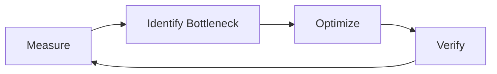
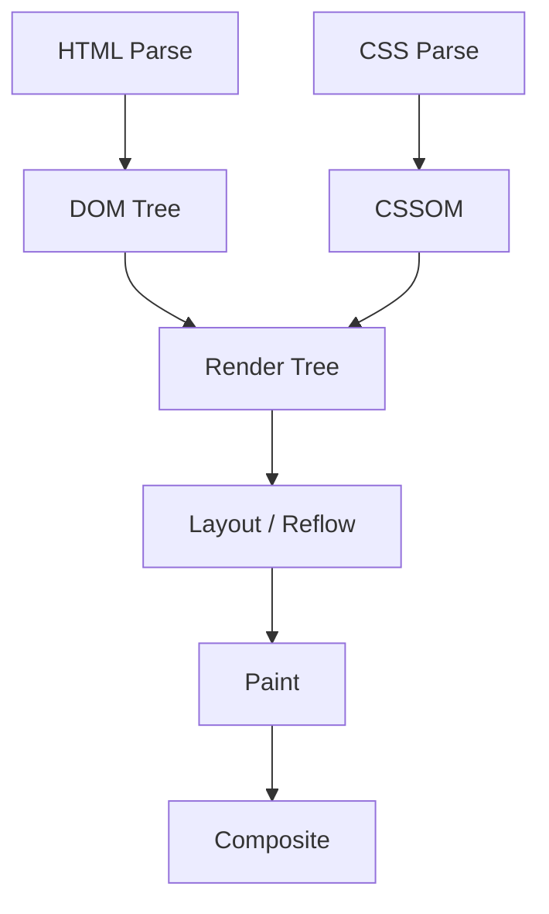
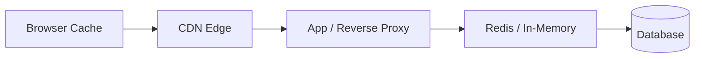
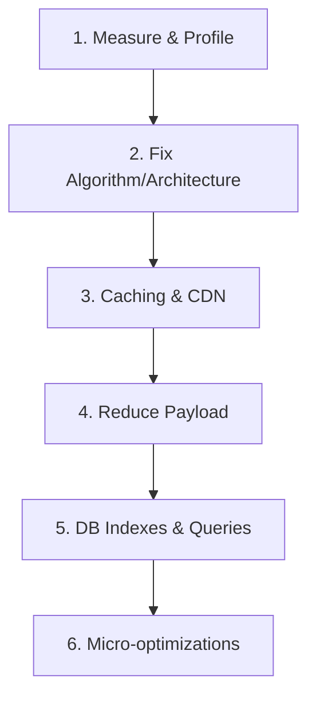

# Performance Optimization — Comprehensive Interview Preparation Guide

> **How to use this guide:** Measure first, optimize second. Read fundamentals top-to-bottom, drill **Scenario Questions** and the **Cheat Sheet** before interviews.

---

## Table of Contents

1. [Performance Fundamentals](#1-performance-fundamentals)
2. [Frontend Optimization](#2-frontend-optimization)
3. [Browser Rendering](#3-browser-rendering)
4. [Lazy Loading & Code Splitting](#4-lazy-loading--code-splitting)
5. [Memoization, Debouncing & Throttling](#5-memoization-debouncing--throttling)
6. [Bundle Optimization & Tree Shaking](#6-bundle-optimization--tree-shaking)
7. [Virtualization & Image Optimization](#7-virtualization--image-optimization)
8. [Caching & CDN](#8-caching--cdn)
9. [Network Optimization & Compression](#9-network-optimization--compression)
10. [Backend Optimization](#10-backend-optimization)
11. [API Optimization](#11-api-optimization)
12. [Database Optimization](#12-database-optimization)
13. [Query Optimization & Indexing](#13-query-optimization--indexing)
14. [Profiling & Monitoring](#14-profiling--monitoring)
15. [Lighthouse & Core Web Vitals](#15-lighthouse--core-web-vitals)
16. [Production Performance](#16-production-performance)
17. [Best Practices](#17-best-practices)
18. [Scenario Questions](#18-scenario-questions)
19. [Cheat Sheet](#19-cheat-sheet)

---

## 1. Performance Fundamentals

### Q: What is performance optimization?

**A:** The systematic process of improving speed, throughput, resource usage, and user-perceived responsiveness of an application — without sacrificing correctness or maintainability.

### Q: What is the golden rule of optimization?

**A:** **Measure before you optimize.** Profile real workloads, identify bottlenecks, fix the slowest path, and verify with metrics. Premature optimization wastes time and adds complexity.



### Q: What are the main layers of performance?

| Layer | Focus | Key Metrics |
|-------|-------|-------------|
| **Frontend** | Rendering, JS, assets | LCP, INP, CLS |
| **Network** | Latency, bandwidth | TTFB, transfer size |
| **Backend** | CPU, memory, I/O | p95 latency, throughput |
| **Database** | Queries, indexes | Query time, connections |
| **Infrastructure** | Scaling, caching | Availability, cost |

### Q: Latency vs throughput — what's the difference?

**A:**
- **Latency** — time for a single operation (e.g., API response in 120ms).
- **Throughput** — operations per unit time (e.g., 5,000 requests/second).

High throughput with high latency is bad UX; low latency with low throughput may not scale.

### Q: What is perceived performance?

**A:** How fast the app *feels* to users — often more important than raw metrics. Techniques: skeleton screens, optimistic UI, progressive loading, instant feedback on clicks.

### Q: What are SLIs, SLOs, and SLAs?

| Term | Meaning |
|------|---------|
| **SLI** (Indicator) | Measurable metric — e.g., p95 API latency |
| **SLO** (Objective) | Target — e.g., p95 < 200ms for 99.9% of requests/month |
| **SLA** (Agreement) | Contract with consequences if SLO breached |

---

## 2. Frontend Optimization

### Q: What are the top frontend performance levers?

**A:**
1. Reduce JavaScript payload and execution time
2. Optimize critical rendering path
3. Lazy-load non-critical resources
4. Cache aggressively with correct headers
5. Minimize layout thrashing and re-renders (React/Vue)

### Q: How do you optimize React performance?

**A:**
- `React.memo` for expensive pure components
- `useMemo` / `useCallback` for stable references
- Virtualize long lists (`react-window`, `@tanstack/react-virtual`)
- Code-split routes with `React.lazy` + `Suspense`
- Avoid inline object/function props causing re-renders
- Move state down; colocate state with consumers
- Use production builds; analyze bundle with `webpack-bundle-analyzer`
- Split context to avoid broad re-renders

### Q: How do you optimize Vue/Angular?

**A:**
- **Vue:** `v-once`, `v-memo`, computed properties, async components, `defineAsyncComponent`, keep-alive for route caching
- **Angular:** OnPush change detection, trackBy in `*ngFor`, lazy-loaded modules, pure pipes, detach change detector for static subtrees

### Q: What is the critical rendering path?

**A:** The sequence: HTML → DOM, CSS → CSSOM → Render Tree → Layout → Paint → Composite. Blocking CSS/JS delays first paint. Inline critical CSS; defer non-critical JS.

### Q: How do you reduce main-thread work?

**A:**
- Split long tasks (< 50ms chunks) with `requestIdleCallback` or Web Workers
- Defer analytics and non-essential scripts
- Use `will-change` sparingly for animations
- Prefer CSS transforms over layout-triggering properties
- Offload heavy computation to Web Workers

### Q: How do you optimize third-party scripts?

**A:** Load analytics/chat widgets asynchronously, use `facade` pattern (fake button until interaction), self-host if possible, set `async`/`defer`, monitor with `PerformanceObserver` for long tasks caused by third parties.

### Q: Service Workers and PWA caching?

**A:** Service Workers intercept network requests. Strategies:
- **Cache-first** — static assets (offline support)
- **Network-first** — API data (freshness)
- **Stale-while-revalidate** — fast + background update

---

## 3. Browser Rendering

### Q: What happens when the browser renders a page?



### Q: What triggers reflow (layout)?

**A:** Changes to geometry: width, height, padding, margin, font-size, DOM insertions. Reflow is expensive — batch DOM reads/writes, use `documentFragment`, avoid reading layout properties in loops.

### Q: What triggers repaint vs composite-only?

| Change | Cost |
|--------|------|
| `color`, `visibility` | Repaint |
| `transform`, `opacity` | Composite only (GPU) |
| `width`, `height`, `top`, `left` | Layout + Paint |

**Tip:** Animate `transform` and `opacity` for 60fps.

### Q: What is layout thrashing?

**A:** Alternating DOM reads (`offsetHeight`) and writes in a loop, forcing synchronous layout recalculations. **Fix:** batch reads, then batch writes.

```javascript
// Bad — thrashing
els.forEach(el => { el.style.width = el.offsetWidth + 10 + 'px'; });

// Good — read then write
const widths = els.map(el => el.offsetWidth);
els.forEach((el, i) => { el.style.width = widths[i] + 10 + 'px'; });
```

### Q: What is the compositor thread?

**A:** Handles painting layers and compositing on GPU. Properties that only affect compositor (`transform`, `opacity`) skip layout and paint — cheapest animations.

### Q: What is `content-visibility: auto`?

**A:** CSS property that skips rendering of off-screen content until near viewport — significant win for long pages without full virtualization.

---

## 4. Lazy Loading & Code Splitting

### Q: What is lazy loading?

**A:** Deferring loading of resources until needed — images below the fold, route components, modals, heavy libraries.

```javascript
// React route-level code splitting
const Dashboard = React.lazy(() => import('./Dashboard'));

function App() {
  return (
    <Suspense fallback={<Spinner />}>
      <Dashboard />
    </Suspense>
  );
}
```

### Q: What is code splitting?

**A:** Breaking a monolithic bundle into smaller chunks loaded on demand. Reduces initial parse/compile time and TTI (Time to Interactive).

| Strategy | When |
|----------|------|
| **Route-based** | SPA pages |
| **Component-based** | Heavy widgets (charts, editors) |
| **Vendor splitting** | Separate `react`, `lodash` chunks |

### Q: Native image lazy loading?

```html

```

Use `IntersectionObserver` for custom lazy-load logic or background images.

### Q: Lazy loading vs code splitting?

**A:** Lazy loading defers *when* a resource loads. Code splitting is *how* JS is divided into separate files. They often work together.

### Q: Dynamic import in vanilla JS / Vite?

```javascript
button.addEventListener('click', async () => {
  const { heavyFn } = await import('./heavy-module.js');
  heavyFn();
});
```

Vite and Webpack automatically create separate chunks for dynamic imports.

---

## 5. Memoization, Debouncing & Throttling

### Q: What is memoization?

**A:** Caching the result of a pure function call based on inputs. Avoids redundant expensive computation.

```javascript
function memoize(fn) {
  const cache = new Map();
  return (...args) => {
    const key = JSON.stringify(args);
    if (cache.has(key)) return cache.get(key);
    const result = fn(...args);
    cache.set(key, result);
    return result;
  };
}
```

**React:** `useMemo(() => expensiveCalc(a, b), [a, b])`

### Q: Debouncing vs throttling?

| Technique | Behavior | Use Case |
|-----------|----------|----------|
| **Debounce** | Runs after pause in events | Search input, resize end |
| **Throttle** | Runs at most once per interval | Scroll, mousemove, API polling |

```javascript
function debounce(fn, delay) {
  let timer;
  return (...args) => {
    clearTimeout(timer);
    timer = setTimeout(() => fn(...args), delay);
  };
}

function throttle(fn, limit) {
  let inThrottle;
  return (...args) => {
    if (!inThrottle) {
      fn(...args);
      inThrottle = true;
      setTimeout(() => (inThrottle = false), limit);
    }
  };
}
```

### Q: Leading vs trailing debounce?

**A:** **Trailing** (default) — fires after pause. **Leading** — fires immediately on first call, then ignores until pause. Use leading for button double-click prevention; trailing for search.

### Q: When NOT to memoize?

**A:** When computation is cheap, inputs change every render, or memoization overhead exceeds savings. Profile first.

### Q: `requestAnimationFrame` for scroll?

**A:** Throttle scroll handlers with `rAF` — runs once per frame (~16ms), synced with paint cycle. Better than arbitrary `setTimeout` for visual updates.

---

## 6. Bundle Optimization & Tree Shaking

### Q: What is tree shaking?

**A:** Dead-code elimination at build time. ES modules (`import`/`export`) enable bundlers (Webpack, Rollup, esbuild) to drop unused exports.

```javascript
// Good — tree-shakeable
import { debounce } from 'lodash-es';

// Bad — imports entire library
import _ from 'lodash';
```

### Q: How do you reduce bundle size?

**A:**
- Analyze bundle (`source-map-explorer`, `webpack-bundle-analyzer`, `rollup-plugin-visualizer`)
- Replace heavy libs (`moment` → `dayjs`/`date-fns`, `lodash` → native)
- Dynamic imports for optional features
- Enable minification + compression (Terser, Brotli)
- Set `sideEffects: false` in `package.json` where safe
- Use framework production builds
- Remove duplicate dependencies (`npm dedupe`)

### Q: What is differential serving?

**A:** Serve modern ES modules to modern browsers and legacy bundles to older ones — smaller payloads for most users.

### Q: Webpack vs Vite vs esbuild for bundles?

| Tool | Strength |
|------|----------|
| **Webpack** | Mature, highly configurable |
| **Vite** | Fast dev (esbuild), Rollup for prod |
| **esbuild** | Extremely fast minify/bundle |
| **Turbopack** | Next.js incremental bundler |

### Q: What are barrel files and why avoid them?

**A:** `index.ts` re-exporting entire module tree can prevent tree shaking — bundler may include everything. Import directly from source files when bundle size matters.

---

## 7. Virtualization & Image Optimization

### Q: What is virtualization (windowing)?

**A:** Rendering only visible items in long lists instead of thousands of DOM nodes.

```javascript
// Libraries: react-window, @tanstack/react-virtual, react-virtuoso
// Concept: render viewport rows + overscan buffer only
```

**When:** 1,000+ rows, infinite scroll feeds, large tables.

### Q: How do you optimize images?

| Technique | Benefit |
|-----------|---------|
| **Modern formats** (WebP, AVIF) | 30–50% smaller |
| **Responsive images** (`srcset`, `sizes`) | Right size per device |
| **Lazy loading** | Defer off-screen |
| **CDN + compression** | Faster delivery |
| **Explicit dimensions** | Prevent CLS |
| **Sprites / SVG** | Icons without many HTTP requests |
| **LQIP / blur placeholder** | Perceived speed |

```html
<picture>
  <source srcset="img.avif" type="image/avif" />
  <source srcset="img.webp" type="image/webp" />
  
</picture>
```

### Q: What is CLS and how do images cause it?

**A:** Cumulative Layout Shift — unexpected layout movement. Images without `width`/`height` or `aspect-ratio` cause content jump when loaded. Always reserve space.

### Q: `srcset` and `sizes` explained?

```html

```

Browser picks best source based on viewport width and device pixel ratio.

### Q: When to use CSS background-image vs ``?

**A:** Use `` for content images (SEO, accessibility, LCP tracking). Background-image for decorative images only.

---

## 8. Caching & CDN

### Q: What caching layers exist?



### Q: HTTP cache headers explained?

| Header | Purpose |
|--------|---------|
| `Cache-Control: max-age=31536000, immutable` | Long-lived static assets |
| `Cache-Control: no-cache` | Revalidate with server |
| `Cache-Control: no-store` | Never cache (sensitive data) |
| `ETag` / `Last-Modified` | Conditional requests (304) |
| `Vary` | Cache varies by header (e.g., `Accept-Encoding`) |

### Q: What is a CDN?

**A:** Content Delivery Network — geographically distributed edge servers cache static assets close to users. Reduces latency and origin load.

**Cache at CDN:** JS, CSS, images, fonts, video segments.  
**Don't cache:** personalized HTML, authenticated API responses (unless keyed correctly).

### Q: Cache invalidation strategies?

**A:**
- **Filename hashing** — `app.a3f2b1.js` (best for static assets)
- **Short TTL + revalidation** — semi-dynamic content
- **Purge API** — CDN purge on deploy
- **Versioned API paths** — `/v2/users`

### Q: Stale-while-revalidate?

```http
Cache-Control: max-age=60, stale-while-revalidate=300
```

Serve stale content instantly while fetching fresh data in background.

### Q: CDN providers and features?

**A:** CloudFront, Cloudflare, Fastly, Akamai. Features: edge caching, DDoS protection, image optimization (Cloudflare Images), Brotli at edge, geographic routing.

---

## 9. Network Optimization & Compression

### Q: How do you reduce network latency?

**A:**
- Use CDN + edge caching
- HTTP/2 or HTTP/3 (multiplexing, QUIC)
- DNS prefetch, preconnect, preload critical resources
- Reduce round trips (bundle, combine requests)
- Co-locate services in same region
- Use connection pooling for APIs

### Q: Gzip vs Brotli?

| Algorithm | Compression | Support |
|-----------|-------------|---------|
| **Gzip** | Good | Universal |
| **Brotli** | Better (15–25%) | Modern browsers |

Enable on server (Nginx, CloudFront) for text: HTML, CSS, JS, JSON, SVG. Pre-compress at build time for static assets.

### Q: What are resource hints?

```html
<link rel="preconnect" href="https://api.example.com" />
<link rel="dns-prefetch" href="https://cdn.example.com" />
<link rel="preload" href="/critical.css" as="style" />
<link rel="prefetch" href="/next-page-chunk.js" />
```

| Hint | When |
|------|------|
| `preconnect` | Critical third-party origin |
| `preload` | Current page needs it soon |
| `prefetch` | Likely needed on next navigation |
| `modulepreload` | ES module needed soon |

### Q: HTTP/2 vs HTTP/3 benefits?

**A:** HTTP/2: multiplexed streams over single TCP connection, header compression (HPACK). HTTP/3: QUIC over UDP — faster connection setup, better on lossy networks, no head-of-line blocking.

### Q: What is TTFB and how to improve it?

**A:** Time To First Byte — server processing + network. Improve: CDN, caching, faster backend, DB query optimization, edge SSR, reduce middleware chain.

---

## 10. Backend Optimization

### Q: What are common backend bottlenecks?

**A:** Slow DB queries, N+1 queries, blocking I/O, memory leaks, unbounded thread pools, synchronous external API calls, missing indexes, no caching, lock contention.

### Q: How do you optimize Node.js performance?

**A:**
- Use async I/O; never block event loop
- Connection pooling for DB (pg-pool, mongoose pool)
- Cluster mode / PM2 for multi-core
- Stream large responses (`pipeline`)
- Cache hot data in Redis
- Profile with `--inspect`, clinic.js, 0x
- Use worker threads for CPU-bound tasks

### Q: How do you optimize Python/Java/Go backends?

| Runtime | Tips |
|---------|------|
| **Python** | asyncio, gunicorn workers, Cython for hot paths, connection pooling |
| **Java** | JVM tuning, thread pools, reactive (WebFlux), avoid premature object allocation |
| **Go** | Goroutines for concurrency, pprof, connection pooling, avoid unnecessary allocations |

### Q: Connection pooling — why?

**A:** Opening DB connections is expensive. A pool reuses connections, limiting max concurrent connections and preventing DB overload.

```javascript
const pool = new Pool({ max: 20, idleTimeoutMillis: 30000 });
```

### Q: Horizontal vs vertical scaling?

| Type | Approach | Limit |
|------|----------|-------|
| **Vertical** | Bigger machine | Hardware ceiling |
| **Horizontal** | More instances + load balancer | Requires stateless design |

### Q: What is a circuit breaker?

**A:** Stops calling failing downstream service after threshold — prevents cascade failures. States: closed → open → half-open. Libraries: resilience4j, opossum (Node).

---

## 11. API Optimization

### Q: How do you design performant APIs?

**A:**
- Pagination (cursor > offset for large datasets)
- Field filtering (`?fields=id,name`)
- Compression (gzip/brotli)
- Batch endpoints to reduce round trips
- GraphQL DataLoader for N+1 (or JOIN in REST)
- Async processing for heavy jobs (queue + webhook/poll)
- Rate limiting to protect backend
- HTTP caching headers for idempotent GETs
- ETags for conditional requests

### Q: What is the N+1 problem?

**A:** 1 query for list + N queries for related data.

```javascript
// Bad — N+1
const users = await User.findAll();
for (const u of users) u.orders = await Order.findByUser(u.id);

// Good — single JOIN or IN query
const users = await User.findAll({ include: [Order] });
// Or: DataLoader batching in GraphQL
```

### Q: Pagination: offset vs cursor?

| Method | Pros | Cons |
|--------|------|------|
| **Offset** | Simple, random page access | Slow on large offsets (`OFFSET 100000`) |
| **Cursor** | Stable, fast | No random page jump |

```sql
-- Cursor-based
SELECT * FROM posts WHERE id > :lastId ORDER BY id LIMIT 20;
```

### Q: GraphQL performance tips?

**A:** Depth/complexity limits, DataLoader batching, persisted queries, avoid over-fetching with precise selections, dataloader per request (not global).

### Q: REST vs gRPC for performance?

| REST | gRPC |
|------|------|
| JSON text, HTTP/1.1 or HTTP/2 | Protobuf binary, HTTP/2 |
| Human-readable, browser-friendly | Faster serialization, streaming |
| Good for public APIs | Best for internal microservices |

### Q: What is API response compression?

**A:** Enable gzip/brotli on JSON responses > 1KB. Nginx `gzip_types application/json`. Reduces transfer size 70–90% for text.

---

## 12. Database Optimization

### Q: Database optimization checklist?

**A:**
1. Add indexes for WHERE, JOIN, ORDER BY columns
2. Optimize slow queries (EXPLAIN ANALYZE)
3. Normalize vs denormalize intentionally
4. Read replicas for read-heavy workloads
5. Connection pooling
6. Partition large tables
7. Archive cold data
8. Tune DB config (buffer pool, work_mem, shared_buffers)

### Q: Read replica use cases?

**A:** Offload read traffic from primary. Accept eventual consistency for dashboards, search, analytics. Writes always go to primary.

### Q: When to denormalize?

**A:** When read performance matters more than write simplicity — duplicate counts, materialized views, embedded documents (NoSQL). Trade storage and consistency complexity for speed.

### Q: SQL vs NoSQL performance trade-offs?

| SQL | NoSQL |
|-----|-------|
| Joins, ACID, complex queries | Horizontal scale, simple access patterns |
| Index tuning critical | Schema design = query design |
| Vertical + read replicas | Sharding native |

### Q: Connection pool sizing?

**A:** Rule of thumb: `connections = (core_count * 2) + effective_spindle_count` for traditional DBs. Monitor pool exhaustion — too few = queueing; too many = DB overload.

---

## 13. Query Optimization & Indexing

### Q: How do indexes work?

**A:** Data structures (usually B-Tree) that let the DB find rows without full table scan. Like a book index — jump to relevant pages.

```sql
CREATE INDEX idx_orders_customer_date ON orders(customer_id, order_date);
```

### Q: Index types?

| Type | Use Case |
|------|----------|
| **B-Tree** | Default; equality, range, sorting |
| **Hash** | Exact match only (PostgreSQL, MySQL MEMORY) |
| **GIN/GiST** | Full-text, JSON, geospatial (PostgreSQL) |
| **Covering** | Index-only scan |
| **Partial** | Index subset of rows (`WHERE active = true`) |

### Q: Composite index column order?

**A:** Leftmost prefix rule. Index `(a, b, c)` helps queries on `a`, `a+b`, `a+b+c` — not `b` alone. Put most selective / most filtered column first (usually).

### Q: When do indexes hurt?

**A:** Extra storage, slower INSERT/UPDATE/DELETE (index maintenance). Don't over-index low-cardinality columns alone or tiny tables.

### Q: How to analyze a slow query?

```sql
EXPLAIN ANALYZE SELECT * FROM orders WHERE customer_id = 42 AND status = 'pending';
```

Look for: `Seq Scan` (bad on large tables), high cost, rows mismatch estimates, nested loop on large sets.

### Q: Common query anti-patterns?

| Anti-pattern | Fix |
|--------------|-----|
| `SELECT *` | Select needed columns |
| Functions on indexed column `WHERE YEAR(d)=2024` | Range: `d >= '2024-01-01'` |
| `LIKE '%term'` | Full-text search index (GIN) |
| Missing JOIN condition | Proper FK + indexes |
| Unbounded queries | Always LIMIT + pagination |
| OR conditions | UNION or separate indexes |

### Q: Covering index?

**A:** Index contains all columns needed by query — index-only scan, no table lookup.

```sql
CREATE INDEX idx_cover ON orders(customer_id) INCLUDE (amount, status);
```

### Q: What is query plan caching?

**A:** DB caches parsed execution plans. Parameterized queries reuse plans; ad-hoc strings may cause re-parse overhead.

---

## 14. Profiling & Monitoring

### Q: What is profiling vs monitoring?

| Profiling | Monitoring |
|-----------|------------|
| Deep dive, short sessions | Continuous, production |
| Find root cause | Detect regressions, alert |
| Chrome DevTools, perf | Datadog, Prometheus, Sentry |

### Q: Key tools?

| Layer | Tools |
|-------|-------|
| **Frontend** | Chrome DevTools Performance, Lighthouse, WebPageTest |
| **Node.js** | clinic.js, 0x, `--cpu-prof`, `--heap-prof` |
| **Backend** | APM (New Relic, Datadog), pprof |
| **Database** | `EXPLAIN`, pg_stat_statements, slow query log |
| **Infrastructure** | Grafana, Prometheus, CloudWatch |
| **Load testing** | k6, Artillery, Locust, JMeter |

### Q: What metrics to track in production?

**A:** p50/p95/p99 latency, error rate, throughput (RPS), CPU/memory, DB connection pool usage, cache hit ratio, queue depth, Core Web Vitals (RUM), saturation.

### Q: What is Real User Monitoring (RUM)?

**A:** Collect performance data from actual users (navigation timing, LCP, errors). Synthetic tests (Lighthouse CI) complement but don't replace RUM.

### Q: USE vs RED methods?

| Method | Metrics |
|--------|---------|
| **USE** (resources) | Utilization, Saturation, Errors |
| **RED** (services) | Rate, Errors, Duration |

### Q: What is a performance regression?

**A:** Metric degrades after deploy. Detect via: CI performance budgets, canary deployments, comparing p95 before/after, automated Lighthouse CI gates.

---

## 15. Lighthouse & Core Web Vitals

### Q: What is Lighthouse?

**A:** Google's automated auditing tool for Performance, Accessibility, Best Practices, SEO, and PWA. Run in Chrome DevTools, CLI, or CI.

```bash
npx lighthouse https://example.com --output html
```

### Q: What are Core Web Vitals?

| Metric | Measures | Good | Needs Improvement | Poor |
|--------|----------|------|-------------------|------|
| **LCP** | Loading | ≤ 2.5s | 2.5–4.0s | > 4.0s |
| **INP** | Interactivity | ≤ 200ms | 200–500ms | > 500ms |
| **CLS** | Visual stability | ≤ 0.1 | 0.1–0.25 | > 0.25 |

> **Note:** FID was replaced by INP as a Core Web Vital (March 2024).

### Q: How to improve LCP?

**A:** Optimize hero image (WebP, preload), preload LCP element, reduce TTFB (CDN, caching), eliminate render-blocking resources, use SSR/SSG for fast HTML, server-side image optimization.

### Q: How to improve INP?

**A:** Reduce main-thread blocking JS, split long tasks, optimize event handlers (debounce), use Web Workers for heavy work, minimize re-renders on interaction.

### Q: How to improve CLS?

**A:** Set image/video dimensions, reserve ad space, avoid inserting content above existing content, use `font-display: optional` or metric-compatible fallback fonts.

### Q: Other important metrics?

| Metric | Meaning |
|--------|---------|
| **TTFB** | Server response start |
| **FCP** | First content painted |
| **TTI** | Page fully interactive |
| **TBT** | Total Blocking Time (lab) |
| **Speed Index** | How quickly content populates |

### Q: Lab vs field data?

| Lab (Lighthouse) | Field (CrUX / RUM) |
|------------------|---------------------|
| Controlled, reproducible | Real users, real networks |
| Good for debugging | Good for SLOs and SEO ranking |
| May not match production | 75th percentile used by Google |

---

## 16. Production Performance

### Q: Production performance checklist?

**A:**
- [ ] Production builds with minification
- [ ] CDN for static assets with long cache + hash filenames
- [ ] Gzip/Brotli enabled
- [ ] DB indexes on hot queries
- [ ] Connection pooling configured
- [ ] Redis/cache for hot reads
- [ ] Rate limiting + circuit breakers
- [ ] Health checks + autoscaling
- [ ] RUM + error tracking (Sentry)
- [ ] Lighthouse CI or Web Vitals budget in CI
- [ ] Load testing before launch (k6, Artillery)
- [ ] Graceful degradation under load

### Q: What are performance budgets?

**A:** Limits on bundle size, LCP, total requests. Fail CI if exceeded — prevents regressions.

```json
{
  "resourceSizes": [{ "resourceType": "script", "budget": 300 }],
  "timings": [{ "metric": "interactive", "budget": 5000 }]
}
```

### Q: SSR vs CSR vs SSG performance?

| Approach | Strength | Weakness |
|----------|----------|----------|
| **CSR** | Rich interactivity | Slow FCP on slow devices |
| **SSR** | Fast FCP, SEO | Server load, TTFB |
| **SSG** | Fastest static | Stale until rebuild |
| **ISR** | Balance freshness + speed | Complexity |
| **Streaming SSR** | Progressive HTML | Partial hydration complexity |

### Q: Canary and blue-green for performance?

**A:** Deploy to small traffic slice; compare p95 latency and error rate before full rollout. Roll back if regression detected.

### Q: Autoscaling triggers?

**A:** Scale on CPU, memory, request queue depth, or custom metric (p95 latency). Scale-down cooldown prevents flapping.

---

## 17. Best Practices

### Q: Top 10 performance best practices?

1. **Measure** with real data (RUM + profiling)
2. **Optimize the bottleneck** — not random micro-optimizations
3. **Reduce payload** — smaller bundles, images, API responses
4. **Cache at every layer** — browser, CDN, app, DB
5. **Lazy load** non-critical resources
6. **Index** database queries used in production
7. **Avoid blocking** the main thread and event loop
8. **Use CDN** for static assets globally
9. **Set budgets** and monitor in CI/production
10. **Document trade-offs** — cache invalidation, consistency

### Q: Performance anti-patterns to avoid?

**A:** Optimizing without metrics, caching everything with no TTL strategy, giant unvirtualized lists, loading all npm dependencies globally, `SELECT *`, synchronous file I/O in Node request handlers, missing error boundaries causing retry storms, over-memoization in React.

### Q: Performance optimization priority order?



---

## 18. Scenario Questions

### Q1: "Our homepage LCP is 6 seconds. How do you debug?"

**A:**
1. Run Lighthouse — identify LCP element (usually hero image or H1)
2. Check TTFB (server slow?) vs resource load (image too large?)
3. Fix: optimize/compress hero image, preload LCP resource, inline critical CSS, CDN, reduce render-blocking JS
4. Verify with field data (CrUX) and RUM

---

### Q2: "API p95 latency jumped from 200ms to 2s after deploy."

**A:**
1. Check APM traces — which endpoint/span regressed?
2. Compare DB slow query log, connection pool saturation
3. Check for N+1 introduced, missing index, cache stampede
4. Roll back if critical; fix forward with index + query optimization

---

### Q3: "React app freezes on scroll with 10,000 items."

**A:** DOM has 10,000 nodes — use list virtualization (`react-window`). Memoize row components. Avoid inline functions in render. Check DevTools Performance for long tasks during scroll. Consider `content-visibility: auto`.

---

### Q4: "Search box fires API on every keystroke."

**A:** Debounce 300ms. Cancel in-flight requests with `AbortController`. Show cached results instantly. Consider client-side filter for small datasets.

---

### Q5: "Bundle size grew from 200KB to 1.2MB."

**A:** Run bundle analyzer. Find accidental full-library imports. Replace heavy deps. Code-split routes. Enable tree shaking. Check for duplicate packages (`npm dedupe`). Audit new dependencies.

---

### Q6: "Database CPU at 95% during peak."

**A:** Identify top queries (`pg_stat_statements`). Add missing indexes. Kill full table scans. Scale read replicas. Cache hot queries in Redis. Tune connection pool limits. Archive old data.

---

### Q7: "How would you optimize images on an e-commerce site?"

**A:** CDN + WebP/AVIF with fallbacks, responsive `srcset`, lazy load below fold, explicit dimensions for CLS, compress at upload, blur placeholder (LQIP), SVG for icons, image CDN with on-the-fly resize.

---

### Q8: "When would you NOT use caching?"

**A:** Financial balances requiring strong consistency, real-time inventory with race conditions, personalized auth-sensitive data without proper cache keys, data that changes every request and is cheap to compute.

---

### Q9: "Mobile users report slow app but desktop is fine."

**A:** Check JS bundle size and parse time on mid-tier Android. Test on throttled 3G. Reduce main-thread work. Check INP on mobile. Use RUM segmented by device. Consider lighter mobile bundle.

---

### Q10: "How do you optimize a Next.js app for production?"

**A:** Use `next/image`, static generation where possible, dynamic imports, analyze with `@next/bundle-analyzer`, enable compression, edge middleware for geo-routing, ISR for semi-static pages, prefetch links.

---

### Q11: "Cache hit ratio dropped from 90% to 40%."

**A:** Check TTL changes, deploy invalidating keys, traffic pattern shift (new data), cache stampede after expiry, memory eviction (Redis `maxmemory`). Monitor key distribution and hot keys.

---

### Q12: "How do you set up performance monitoring from scratch?"

**A:** Frontend RUM (web-vitals library → analytics). Backend APM (Datadog/New Relic). Prometheus + Grafana for infra. Sentry for errors. Define SLOs. Alert on p95 latency and error rate. Lighthouse CI in pipeline.

---

## 19. Cheat Sheet

### Frontend Quick Reference

| Technique | One-liner |
|-----------|-----------|
| Code splitting | Load JS on demand per route/feature |
| Lazy loading | Defer off-screen/heavy resources |
| Memoization | Cache pure function / computed results |
| Debounce | Wait for pause (search) |
| Throttle | Max once per interval (scroll) |
| Virtualization | Render visible list rows only |
| Tree shaking | Remove unused exports at build |
| `transform`/`opacity` | GPU-friendly animations |

### Caching Quick Reference

| Layer | TTL Guideline |
|-------|---------------|
| Hashed static assets | 1 year + immutable |
| HTML (SSR) | Short or no-cache |
| API reads | Seconds–minutes + invalidation |
| DB query cache | Careful — invalidation is hard |

### Core Web Vitals Targets

| Metric | Good | Poor |
|--------|------|------|
| LCP | ≤ 2.5s | > 4.0s |
| INP | ≤ 200ms | > 500ms |
| CLS | ≤ 0.1 | > 0.25 |

### HTTP Compression

```
Enable Brotli (text) > Gzip fallback
Preconnect to API + CDN origins
HTTP/2 or HTTP/3
Compress JSON API responses
```

### Database Index Rules

```
Index WHERE, JOIN, ORDER BY columns
Leftmost prefix on composite indexes
EXPLAIN ANALYZE before and after
Avoid functions on indexed columns
Partial indexes for filtered queries
```

### Optimization Priority

```
1. Measure (Lighthouse, APM, EXPLAIN)
2. Fix biggest bottleneck (algorithm/architecture)
3. Cache + CDN
4. Reduce payload
5. Micro-optimizations last
```

### Interview One-Liners

- **"Measure first"** — always lead with profiling
- **"Critical rendering path"** — shows browser knowledge
- **"N+1"** — common API/ORM pitfall
- **"p95 latency"** — production-minded metric
- **"Cache invalidation"** — know trade-offs, use hashed filenames
- **"CLS"** — set image dimensions
- **"Virtualization"** — large list answer
- **"Cursor pagination"** — better than offset at scale
- **"Circuit breaker"** — protect downstream services

---

*End of Performance Optimization Guide*
